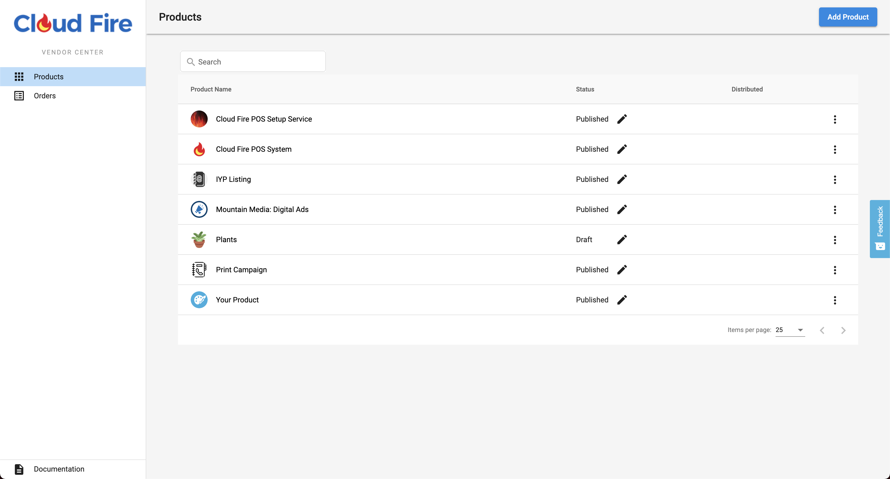
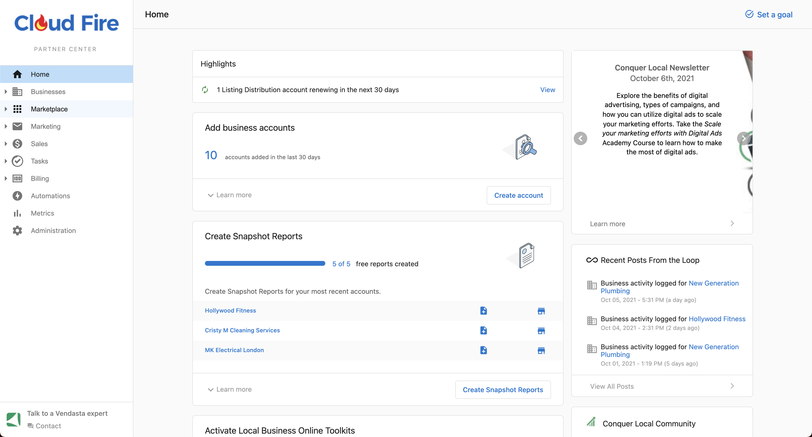
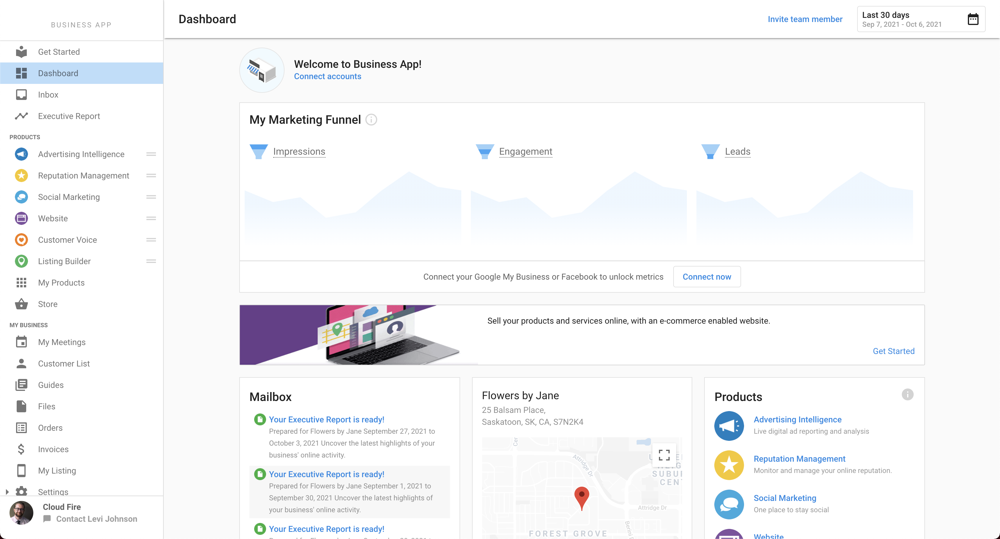

# Getting Started

The Guides available below will provide an overview of creating a Marketplace sku, take you through the Vendasta Dashboards that you will be working with for testing, and detail the basic usage of the Marketplace Vendor API & Webhooks. 
If you intend to distribute your product to the Vendasta Reseller network rather than offer it to your customers only, please review the Marketplace [integration requirements](./integration_requirements.md).

<!-- theme: info -->
>**Learn More** 
>
>If you are new to Marketplace, and want to discover how it can accelerate your sales, learn more, and request to become a Vendor <a href="https://www.vendasta.com/marketplace/vendors" target="_blank">HERE</a>

---

## Platform Overview
There are several Vendasta dashboards, which we call 'Centers', that you will interact with to configure, test, and manage your Marketplace Offerings in an ongoing fashion.

### Vendor Center

<!-- theme: info -->
>* Create Products & Add-ons
>* Configure and manage skus
>* View, and Accept or Reject orders of your skus
>* See Resellers selling your skus, and Accounts your skus are active on
>* Contact Resellers selling your skus via the [Inbox System](https://support.vendasta.com/hc/en-us/articles/7573902039575-Inbox-Messaging-Product-Overview#h_01HCWYPD7GAYGRVHQJ47MSKYCK) when you see an opportunity to accelerate their sales

### Partner Center

_To learn more about Partner Center visit our [Support Center](https://support.vendasta.com/hc/en-us/categories/4406956996375-Partner-Center)_

<!-- theme: info -->
>* [Manage Admin platform access for your team](https://partners.vendasta.com/my-team)
>* [Create test Accounts](https://partners.vendasta.com/manage-accounts)
>* [Test activation of your skus](https://support.vendasta.com/hc/en-us/articles/4406958134807-Activate-products-for-your-customers)
>* [Access the Business App](https://support.vendasta.com/hc/en-us/articles/4406958143383)

### Whitelabelled Business App

_To learn more about Business App visit our [Support Center](https://support.vendasta.com/hc/en-us/categories/4406956997015-Business-App)_

<!-- theme: info -->
>* Test Single Sign On into your Product
>* Test Trial activation
>* Test the Executive Report
>* Test the Activity Stream
>* Test CRM syncing

---
You should now have a basic understanding of the Vendasta ecosystem. If you need clarification on something, or have any suggestions on how to improve this documentation, let us know via the feedback button on the right hand side of Vendor Center.

**Next:** [Managing Products & Services](./offerings.md)
