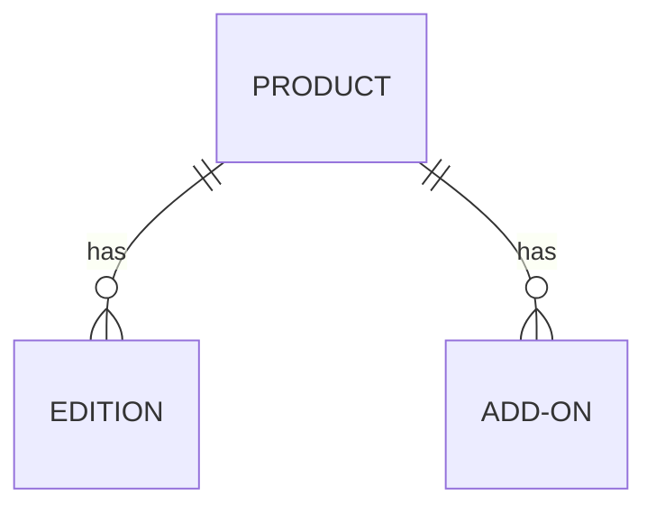
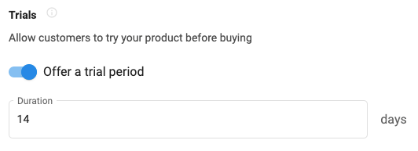
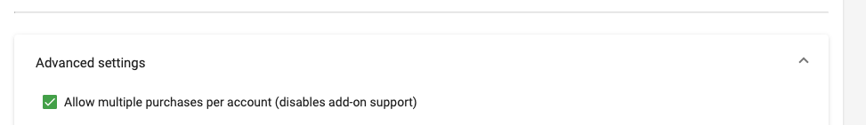
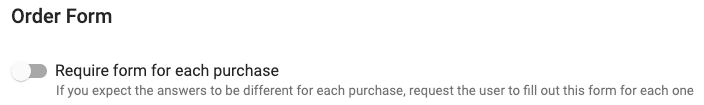
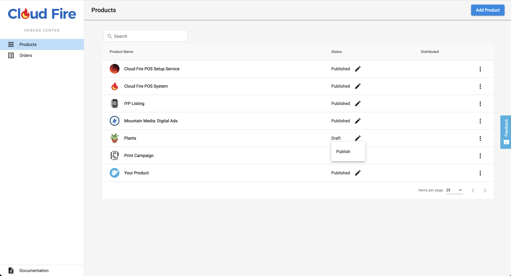
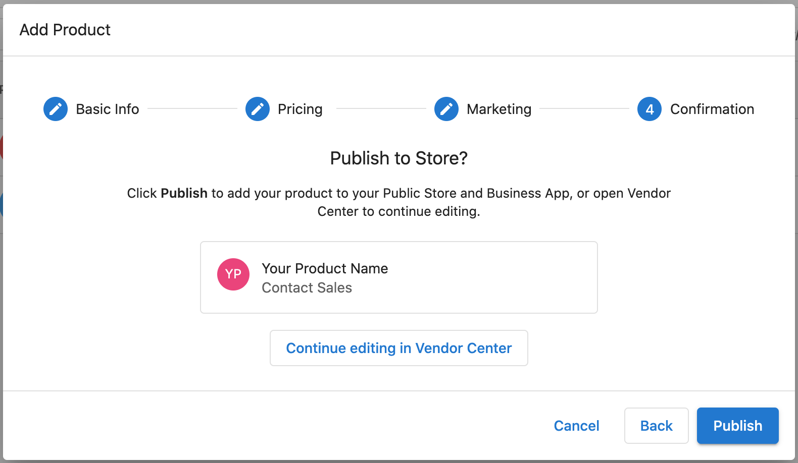

# Configuring your Products and Services

Your offering, whether it be a digital product, a service, or a physical product is represented by a `Product` in the Vendasta Marketplace. The product may have multiple plans or service levels, which we call `Editions`. A product may also have multiple `Add-ons`, which belong to a single parent product alone, and have no relation to the product's `Editions`.

<!-- theme: info -->
>You manage all of your offerings from Vendor Center.  
>
>_**Access Vendor Center**_ by logging in directly in at <a href="https://vendors.vendasta.com" target="_blank">https://vendors.vendasta.com</a>, or navigate from Partner Center using the top navbar App icon beside your name.

## Product

This will represent a _Base Offering_ - Whether that be a Digital Product, a Service, or a Physical Product.

**Creating your first Product**

**Trials**

You are able to set a timed trial for your Product. The Vendor is responsible for in-product behavior after the trial expires.

_Configure in: Product Info-->Pricing & trials_

&nbsp;

**Multi-purchase**

Products are able to be purchased multiple times on the same Account, but not multiple times at once, unlike Add-ons. _If you turn multi-purchasing on for your product, it disables it for your Add-ons_

_Product Info-->Advanced Settings dropdown_

&nbsp;

### Edition

If your _Base Offering_ has multiple plans or versions you can configure it to have any number of `Editions` to represent all product variations.

<!-- theme: info -->
>_Tips:_
>* If you have a _Freemium_ option for your offering, that can be the first Edition. The nomenclature most commonly used for Freemium offerings in the Marketplace is `Express`
>* The Full offering name as displayed will be `[Product Name] | [Edition Name]` so keep this in mind when naming your Editions
<!-- theme: warning -->

> Edition Changes should NOT be rejected due to system limitations at this time.
&nbsp;

### Add-on

Offerings that can not stand on their own, but rather bolt onto a Product. Add-ons can be very simple - utilized as a simple billing mechanism, or can be built out with the same marketing and details as a Product. Add-ons can be used for a variety of purposes. 

_Common uses for Add-ons:_
* Services associated with a specific Product
* À la carte features that accentuate an app, and are independent of Editions.
* Hardware purchases - _Utilize Order Form for collecting shipping information_

_Using Add-ons to help fill out your billing model:_
* User Seats - _Utilize the 'End User' field on the Order From_
* Purchase of Credits - _Credits usage is managed by Vendor, and displayed in Vendor Dashboard_

**Multi-purchase**

Unlike Products, multiple Add-ons can be purchased at once

For Multi-purchasable Add-ons that include an Order Form, the Order Form can be set to appear once, or you may require a form be filled for every instance of an Add-on purchase.

<!-- theme: warning -->
>_Please Note:_
>
>* Add-ons can not be associated with more than one Product, and would need to be copied to any additional Products it applies to
>* Add-ons can not be associated with specific Editions. If an Add-on is activated on an Edition that doesn't support it, at this time you will need to reject the activation with an appropriate error message.
>* Beyond activation, all other integration features belong to the parent Product. Trials, Reporting, SSO, Activity Stream, and Customer List data is shared with and managed by the parent Product.

&nbsp;

## Order Forms

Order forms may be configured for either Products or Add-ons in Vendor Center.

There are two types of order form fields:

**Common Form Fields**

* Only diplsays in form to user if checked off as required. Fields are auto filled if the data exists for the Account. If available data will be passed on webhook regardless of whether these fields are checked off as being required.
* Business Data is already what's on the Account Object provided in the provisioning webhook, but may be overriden on the order form. Connect with your Operations team to see if the common form fields are intended to be used.

**Custom fields**

* Provide an id that won’t change so the webhooks can operate without interruption even if label names are changed
* The optional front end validation regex uses javascript formatting

<!-- theme: info -->
>_Special Field Type - **End User**:_
>* This field provides a dropdown with all the End Users on the Account
>* Use this to specify who the Admin or Workspace owner will be if this is something that your Product requires. Note that it only provides the `legacy_user_id` in the purchase webhook.
>* You may use this on an Add-on representing a 'seat' if you offer user seat billing to associate the seat with an End User at time of purchase.
--- 
_For a detailed breakdown of how to build out a Marketplace Order Form check out the [Order Form Guide](https://support.vendasta.com/hc/en-us/articles/11457612251799-Order-Form-Guide-for-Marketplace-Vendors)_

&nbsp;

## Publishing

**Publishing Status is controlled in Vendor Center**

_The Publishing status controls the visibility of your Product (and its Add-ons) in your Partner Center. **This does not affect whether other Resellers can see your product - that is the Distribution Status, which is controlled by Vendasta.**_

**Draft Mode**

Draft mode allows you to work on your Product without it being able to be seen by the rest of your company in Partner Center. 

If you create your product in _Vendor Center_, it will start in draft mode. If you create it within _Partner Center_, you will be given a choice as to whether you would like to publish it immediatly, or continue editing in draft mode:

_Move to Draft:_

 You may only move an Product from a Published State back to Draft if it has been set to [Stop Selling](https://support.vendasta.com/hc/en-us/articles/4406952901015#h_cf09ba71-da66-4723-8b6d-b0072f540079) in _Partner Center_. 

**Integration Testing**

If you are utilizing any of the advanced integration features you will need to publish your Product so that you may do integration testing in Partner Center, or Business App since most tests require the Product to be active on an Account.

### Versioning
**Products**
<!-- theme: warning -->
>While not distributed there is no versioning. Once a product is distributed all changes are made in a draft state, and need to be reveiwed by a Vendasta team member, approved and pushed live. 
>
>Please ensure you alert a Vendasta team member if you have made changes to your distributed Product, and need them pushed live.

**Add-ons**

Add-ons do not currently have a versioning system. Any updates you make to your Add-on Marketing, Order Form, etc. will immediately go live.

---

**Next:** [Pricing & Distribution](https://developers.vendasta.com/vendor/ZG9jOjIxMDYwOTE0-pricing-and-distribution)