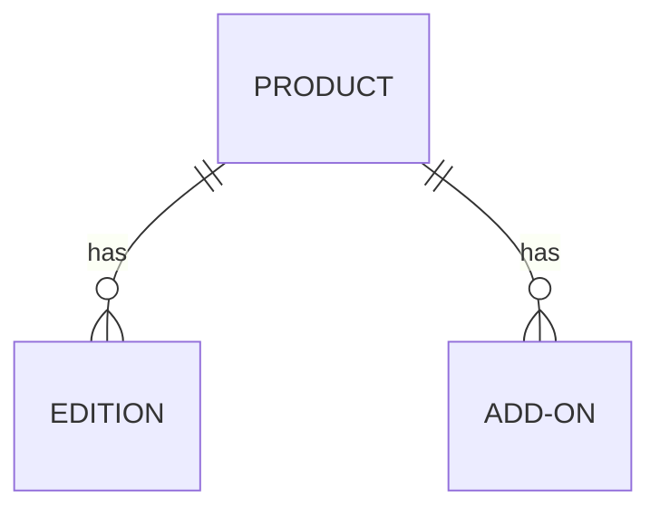

# Configuring your Products and Services

Items you add in Vendor Center, whether they are digital products, services, or physical products are represented by a `Product` in the Vendasta Marketplace. Each product can have multiple plans or service levels, referred to as `Editions`. A product may also have multiple `Add-ons`, which belong to a single parent product, and have no relation to the product's `Editions`.

<!-- theme: info -->
>_**Access Vendor Center**_ by logging in directly in at <a href="https://vendors.vendasta.com" target="_blank">https://vendors.vendasta.com</a>, or navigate from Partner Center using the top navbar App icon beside your name.

## Product

This section will introduce you to the concept of a Base Offering, which can be a digital product, a service, or a physical product.

**Product Creation**

_Utilize the button in the top right to create product_

**Trials**

You are able to enable a timed trial for your Product. Note that you are responsible for in-product behavior after the trial expires, and there is no webhook fired at time of trial expiration.

_Configure in: Product Info-->Pricing & trials_

<!-- theme: info -->
>It is suggested that you leverage the [Activity Stream](../Guides/activity_stream_overview.md) to encourage upgrades during the trial period.
<!-- theme: warning -->
> Trials may be re-activated after being deactivated(an action only a Reseller user can make). This is a feature that allows a Reseller to 'restart' a trial that their end user may not have taken advantage of. You may choose to restrict this, and reject subsequent trial activations on a per Account basis, or instigate a 'trial activation limit' to avoid an 'infinite trial loop'.

&nbsp;

**Multi-purchase**

Products can be purchased multiple times for the same Account. However, a product cannot be purchased multiple times within the same Order, unlike Add-ons. _If you enable multi-purchasing for your product, it will be disabled for your Add-ons_

_Product Info-->Advanced Settings dropdown_

&nbsp;

### Edition

If your _Base Offering_ has multiple plans or versions, you can set up various `Editions` to represent all product variations.

<!-- theme: info -->
>_Tips:_
>* If you have a _Freemium_ option for your offering, you can make it the first Edition. The nomenclature most commonly used for Freemium offerings in the Marketplace is `Express`
>* The offering name as displayed will be `[Product Name] | [Edition Name]`. Please keep this format in mind when naming your Editions

<!-- theme: warning -->
> **Please note:** Due to current system limitations, changes to editions should NOT be rejected.
&nbsp;

### Add-on

Add-ons are offerings that cannot stand alone and are designed to complement a product. They can be straightforward, serving merely as a billing mechanism, or have a detailed marketing page like a Product. 

_Common uses for Add-ons:_
* Services linked to a specific Product
* À la carte features that enhance an app, independent of its editions.
* Hardware purchases. For these, you can use the order form to gather shipping details.

_Using Add-ons to help fill out your billing model:_
* User Seats - _Utilize the 'End User' field on the Order From_
* Purchase of Credits - _Credits usage is managed by Vendor, and displayed in your product's dashboard_

**Multi-purchase**

Unlike Products, multiple Add-ons can be purchased within the same order.

For multi-purchasable Add-ons that include an Order Form, you can configure the form to appear once or require it to be filled out for every Add-on purchase instance.

<!-- theme: warning -->
>_Please Note:_
>
>* An Add-on cannot be linked to more than one product. If you need the same Add-on for multiple products, you'll need to create a copy for each product.
>* Add-ons cannot be linked to specific editions. If an Add-on is activated for an edition that doesn't support it, you'll need to reject the activation and provide a clear error message.
>* Apart from activation, all other integrated features are configured on the parent product even if some are specific to an Add-on. This includes trials, reporting, Single Sign-On (SSO), and the Activity Stream.

&nbsp;

## Order Forms

You can configure order forms for both Products and Add-ons in the Vendor Center.

Order forms contain two sections:

**Common Form Fields**

* These fields are only displayed to the user if marked as required. If data for the account already exists, these fields will auto-fill. The available data will be passed on the webhook, whether these fields are required or not.
* Business data typically comes from the Account Object provided in the provisioning webhook, but it can be overridden on the order form. Consult your Operations team to determine if these common form fields are intended for use.

**Custom fields**

* Provide an id that won’t change so the webhooks can operate without interruption even if label names are changed
* The optional front end validation regex uses JavaScript formatting

<!-- theme: info -->
>_Special Field Type - **End User**:_
>* This field provides a dropdown containing all the End Users associated with the Account
>* If your product requires specifying an Admin or Workspace owner, you can use this field. Note that it only provides the `legacy_user_id` in the purchase webhook.
>* If you offer user seat billing, you can use this field on an Add-on representing a 'seat' to associate the seat with an End User **at the time of purchase**.
--- 
_For a detailed overview of constructing a Marketplace Order Form, refer to the [Order Form Guide](https://support.vendasta.com/hc/en-us/articles/11457612251799-Order-Form-Guide-for-Marketplace-Vendors)_

&nbsp;

## Publishing

**Publishing Status is managed in Vendor Center**

_The Publishing status controls the visibility of your Product (and its Add-ons) in your Partner Center instance. **This status does not influence whether other resellers can view your product. That visibility is determined by the Distribution Status, which Vendasta controls.**_

**Draft Mode**

Draft mode allows you to work on your product without making it visible to the rest of your company in the Partner Center.

* If you initialize your product in the Vendor Center, it will start in draft mode.
* If you create it within the Partner Center, you will be given an option: publish it immediately or continue editing in draft mode:

_Move to Draft:_

You can only revert a product from a published state back to draft  if it has been set to [Stop Selling](https://support.vendasta.com/hc/en-us/articles/4406952901015#h_cf09ba71-da66-4723-8b6d-b0072f540079) in _Partner Center_. 

**Integration Testing**

If you're using any advanced integration features, you'll need to publish your product. This is necessary for integration testing in the Partner Center or Business App since most tests require the product to be active on an account.

### Versioning
**Products**
<!-- theme: warning -->
>**Note:** While a product is not distributed, there is no versioning. Once a product is distributed, all subsequent changes are made in a draft state and need to be reviewed by a Vendasta team member, approved, and then pushed live.
>
>**Request a Review using the button in the 'Compare Product Tab' of your sku**

**Add-ons**

Currently, Add-ons do not have a versioning system. Any updates you make to the Add-on's marketing, order form, etc., will take effect immediately.