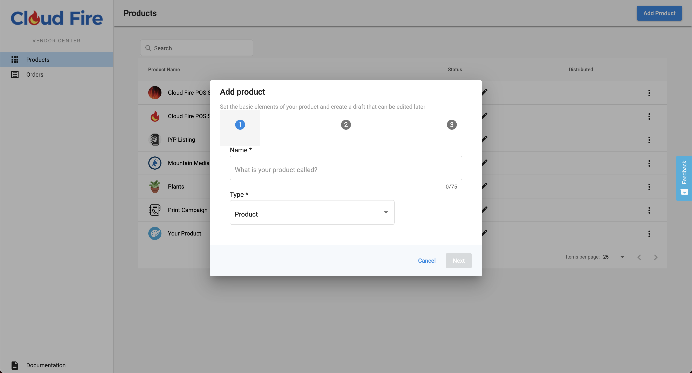
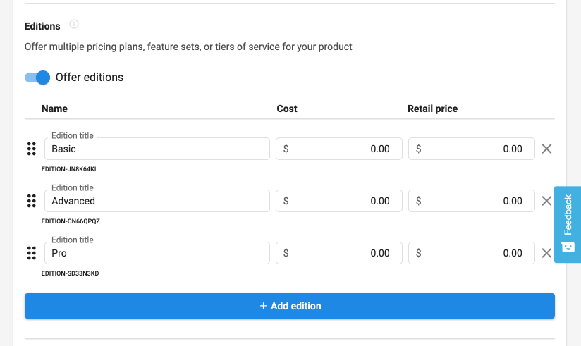
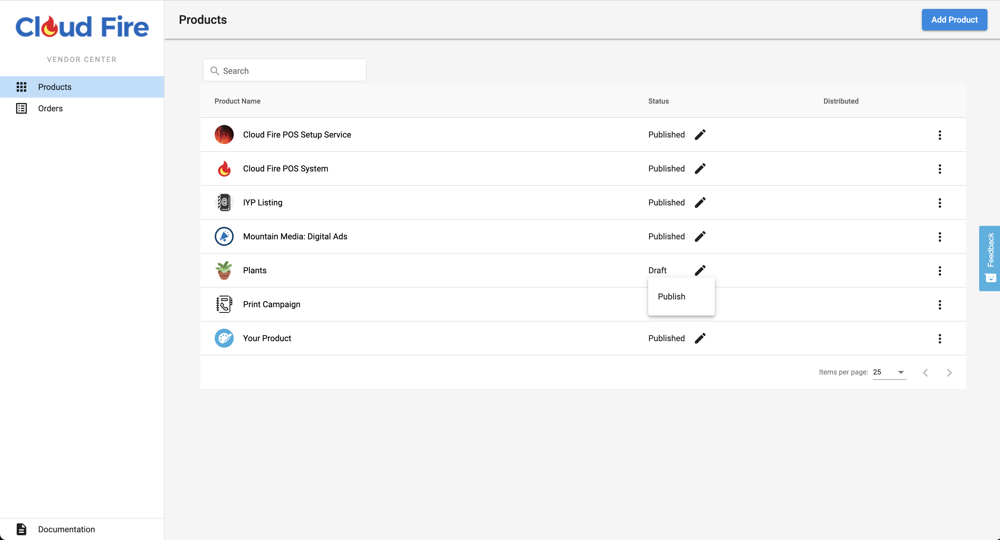

# Configuring your Products and Services

Adapt your Product or Services to be Marketplace Offerings. You have 3 SKU types to work with.

You manage all of your offerings from Vendor Center.  

<!-- theme: info -->
>_**Access Vendor Center**_ by logging in directly in at <a href="https://vendors.vendasta.com" target="_blank">https://vendors.vendasta.com</a>, or navigate from Partner Center using the top navbar App icon beside your name.

## Product

This will represent a _Base Offering_ - Whether that be a Digital Product, a Service, or a Physical Product.

**Creating your first Product**

<!-- theme: info -->
>_**Simple steps for your first test Activation**_
>1. Create Product
>2. Publish Product - This makes the Product available in Partner Center. That is all publishing does - This will not allow other Resellers to see your product! A green checkbox will appear under the _Distributed_ column once your product has been released to the Marketplace.
>3. Create a Test Account
>4. Activate your new product on the test Account.

**Trials**

You are able to set a timed trial for your Product. The Vendor is responsible for in-product behavior after the trial expires.

_Configure in: Product Info-->Pricing & trials_

&nbsp;

**Multi-purchase**

Products are able to be purchased multiple times on the same Account, but not multiple times at once, unlike Add-ons. _If you turn multi-purchasing on for your product, it disables it for your Add-ons_

_Product Info-->Advanced Settings dropdown_

&nbsp;

### Edition

If your _Base Offering_ has multiple plans or versions you can configure it to have any number of `Editions` to represent all product variations.

<!-- theme: info -->
>_Tips:_
>* If you have a _Freemium_ option for your offering, that can be the first Edition. The nomenclature most commonly used for Freemium offerings in the Marketplace is `Express`
>* The Full offering name as displayed will be `[Product Name] | [Edition Name]` so keep this in mind when naming your Editions

&nbsp;

### Add-on

Offerings that can not stand on their own, but rather bolt onto a Product. Add-ons can be very simple - utilized as a simple billing mechanism, or can be built out with the same marketing and details as a Product. Add-ons can be used for a variety of purposes. 

_Common uses for Add-ons:_
* Services associated with a specific Product
* À la carte features that accentuate an app, and are independent of Editions.
* Hardware purchases - _Utilize Order Form for collecting shipping information_

_Using Add-ons to help fill out your billing model:_
* User Seats - _Utilize the 'End User' field on the Order From_
* Purchase of Credits - _Credits usage is managed by Vendor, and displayed in Vendor Dashboard_

**Multi-purchase**

Unlike Products, multiple Add-ons can be purchased at once

For Multi-purchasable Add-ons, the Order Form can be set to appear once, or you may require a form be filled for every instance of an Add-on purchase.

<!-- theme: warning -->
>_Please Note:_
>
>* Currently an Add-on can not be associated with more than one Product, and would need to be copied to any additional Products it applies to
>* Add-on can not be associated with specific Editions. If an Add-on is activated on an Edition that doesn't support it, at this time you will need to reject the activation with an appropriate error message.
>* Beyond activation, all other integration features belong to the parent Product. Trials, Reporting, SSO, Activity Stream, and Customer List data is shared with and managed by the parent Product.

&nbsp;

## Order Forms

If your application requires additional information beyond the basic Account information you receive from the _Purchase Webhook_, or your offering is a service that isn't utilizing the Webhooks, you may configure an order form for your Product or Add-on in Vendor Center.

There are two types of order form fields

**Common Form Fields** - _fields to be auto filled if the data exists for the Account_

These fields are optional by default, but you may check them off as required.

* Business Information - ***It is suggested that if you absolutely need country that you add a required _Custom Field for this as it's not guaranteed to be within the Address field or on the Account object data**
* Primary Contact – The first *User* from the Account. ***It is suggested if you need particular contact information that you add required _Custom Fields_ for this**, so you can add a description indicating who's information you need, and what you will use it for.
* Salesperson – Principle Salesperson the Channel Partner has assigned to the Account

**Custom fields**

* Provide an id that won’t change so the webhooks can operate without interruption even if label names are changed
* The optional front end validation regex uses javascript formatting

<!-- theme: info -->
>_Special Field - **End User**:_
>* This field provides a dropdown with all the users on the Account
>* Use this to specify who the Admin or Workspace owner will be if this is something that your Product requires
>* Use this for your Add-on if you offer user seat billing

**More information** 
For a detailed breakdown of how to build out a Marketplace Order Form check out the [Order Form Guide](https://docs.google.com/document/d/1kYCSYxcSu650aWa9fhaQnDEFiXP1jiPGdShtKK8kO80/edit?usp=sharing)

&nbsp;

## Publishing

**Publishing Status**

Publishing your Product will allow it to be found in the [Discover Products page](https://partners.vendasta.com/marketplace/products) via Search or by checking 'Show My Products' in the filter.

**Draft Mode**

Your Product will start in draft mode when created in Vendor Center. Draft mode allows you to work on your Product without it being able to be seen by the rest of your company in Partner Center. If you create a Product via Partner Center, draft mode will be skipped, and the product will be immediately _Published_ & _Enabled_ allowing it to be used right away. 

_Move to Draft:_

 You may only move an Product from a Published State back to Draft if it has been [Disabled](https://support.vendasta.com/hc/en-us/articles/115001596367#h_cf09ba71-da66-4723-8b6d-b0072f540079). 

**Integration Testing**

It is suggested that if you are utilizing any of the advanced integration features that you publish your Product so that you may do integration testing since most tests require the Product to be active on an Account.

**Add-ons**

Add-ons do not currently have a versioning system. Any updates you make to your Add-on Marketing, Order Form, etc. will immediately go live.

---

**Next:** [Pricing & Distribution](https://developers.vendasta.com/vendor/ZG9jOjIxMDYwOTE0-pricing-and-distribution)