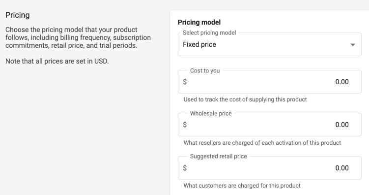

# Pricing-and-Distribution

For _Free_ anyone can become a Vendasta Channel Partner, upload their offerings to the platform, and leverage Vendasta's white-labeled end to end E-Commerce Platform to sell more effectively using their own sales team. 

If you are a Software Vendor, an ISV, or a Channel Partner that wants to expand through Vendasta's 50,000+ channel partners and their 45000+ Salespeople there are _no platform fees_ for distributing and selling your product in the Vendasta Marketplace.

There is a simple revenue share based on the wholesale price of your products. Options are available for Vendor transaction fees to be rendered by _**percentage of the wholesale price**_, or based on a reseller model, where Vendasta is considered a reseller of the Vendor product. Vendasta manages billing of Channel Partners for product activations, and dispenses payment to Vendor monthly.

With this in mind, set your wholesale price and recommended retail so that Channel Partners are enticed to offer your product, and it has a healthy margin.  We recommend setting your wholesale price to allow Channel Partners at least 30% margin on the Recommended Retail Price. Remember, the higher the margin the more attractive it becomes for Channel Partners to sell.

For details on how to set up the pricing for your offerings, please review the Pricing section under the _Product Info_ tab, then refer to the Marketplace <a href="https://docs.google.com/document/d/1NL_u4CFMoBw0p1t3UKvyQJsd6f-UX51Qj92P0wvvA2M/edit" target="_blank">Billing Models Guide</a>

**Distribution**

Once your Product has met all integration requirements, and has been reviewed and approved by Vendasta, your Product will be distributed to the Vendasta Channel Partner network to be discovered and sold.

---
**Next:** [Requirements Checklist](https://developers.vendasta.com/vendor/ZG9jOjE3MTE3MDg2-integration-requirement-checklist)