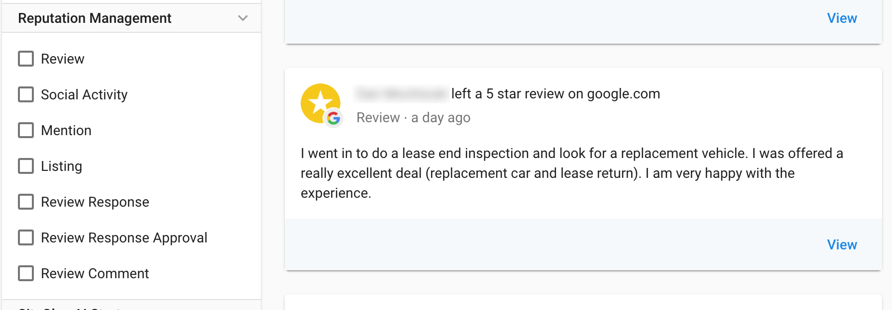
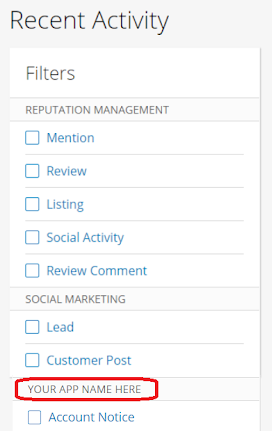
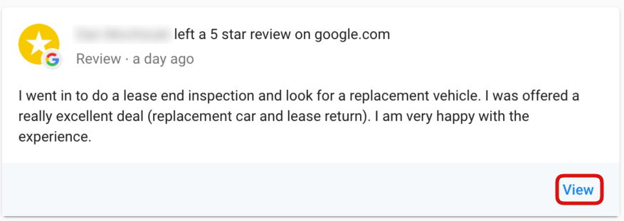
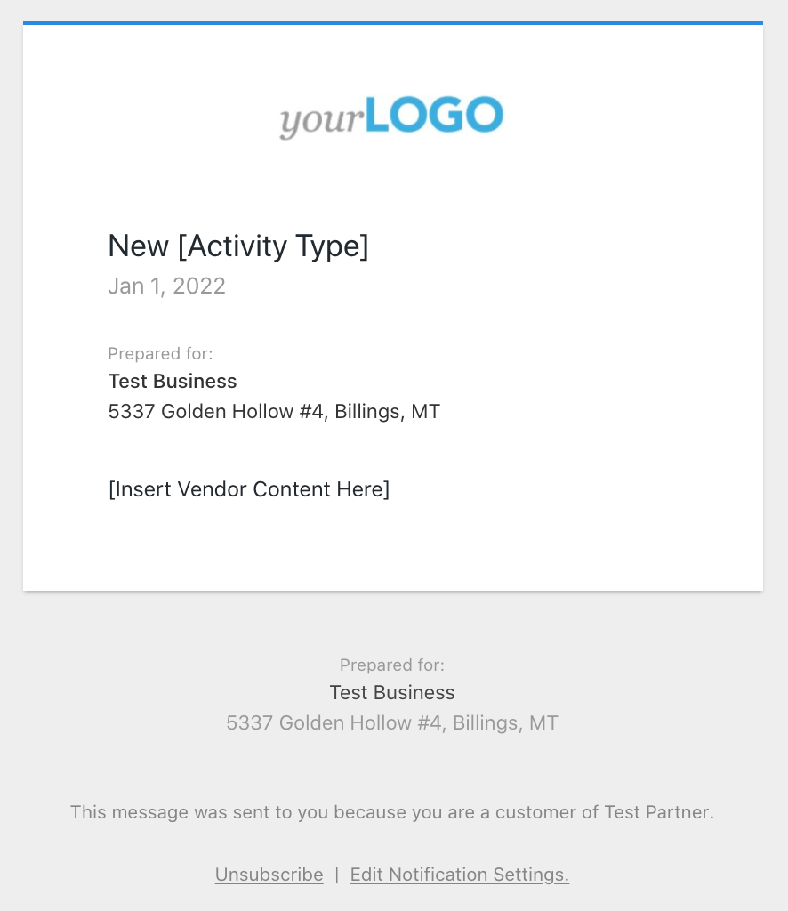

# Activity Stream

## Overview
The Activity Stream is a notification distribution system. A simple API call creates an `Activity` notification Event, and users can individually control their subscription to these Events for all their products from within a single place in their Business Operating System - the Vendasta Business App.

A) Notifications of _Events_ that occur in any Product a Business has purchased are streamed to their Business App UI 'Activity Stream'. Users can then click through to see further details or take a prompted action.

B) Anything that appears in the Stream can be pushed out through instant, or digest based emails which are **automatically branded for the Channel Partner**. By default it will be pushed to all users on the Account; Notification Recipients can then set their preferences individually.

<!-- theme: warning -->
>**Adjust Communications Accordingly**
>
>When you switch your end user communications to flow through the Activity Stream you will want to turn off the corresponding emails on your end so users don’t receive double communications.

## Implementation of the Activity Stream

[View the Activity Stream Schema](https://developers.vendasta.com/vendor/c2NoOjE2NTY5NDA3-activity)

The `Activity Type` is essentially a Notification Category, that allows for filtering of all the `Activities` that are occurring in a Business's active Products.

### Content

Basic HTML is supported by the `content` field and will render appropriately on the Activity Cards in the UI, or in the default email templates. If you have more media heavy reports, you may want to send a message with a link to the report. Even if you don’t have any regular communications we recommend setting up both a welcome message, and a generic Activity Type for any one off communication needs.

### Filters

The following fields are strings used as categories and filters. 

<!-- theme: warning -->
>These ENUMS must be pre configured by Vendasta before you can start using the Activity Stream API. You will get an error indicating your Activity Type is invalid until this is completed. 
>
>[SUBMIT YOUR ACTIVITY TYPES HERE](https://docs.google.com/forms/d/e/1FAIpQLSciEKVtCsTEYzJMeLO3sSjTvdQX8L-XLr9xgjgn3tuldZdfZg/viewform?usp=sf_link) _*Case Sensitive_

**`activity_type`( required ) - Requires ENUM to be configured**

The activity_type is displayed as a Category Header in the Activity Filter in Business App, so should be a user-friendly string. An activity_type should be configured for each type of Notification that will be pushed for an Product

**`settings_tags`(optional) - Requires ENUM to be configured if being used**

Optional sub categories per "activity_type". These Activity sub categories don't show up in the Activity Stream filters, and only apply to the Notification System Emailing preferences.

### Drive Users into your product

The `link` is a required field. When a User selects ‘View’, it calls the Product's Entry URL passing the `link` as the `nextUrl` parameter. This redirect can also occur from within an instant email. The nextUrl allows for deeplinking (directing a user to a page relevant to your Notification). Encode the nextUrl in the state parameter for OAuth SSO, and retrieve it when passed to your redirect_uri.

<!-- theme: info -->
> **Hiding the View link** 
>
>If your Activity requires no action, or your product doesn't have a dashboard, etc., and you want to hide the 'View' link in the Activity tile and instant email, submit `requires_platform_auth` as `false`, and the `link` param with the value `https://nodisplay.com`

### Email Template Options

You can use your existing email html templates if you have them, or create a new dynamic template, for both the Instant Emails, and the Daily Digest.

**Instant Notification Template**

Default Structure:

**Digest Template**

Default Structure: This email has a section for each Product that has had activity for the day

*There will be up to 3 of each type of Notification displayed, and then a ‘View all’ button below if there are more.*

If you feel that your emails require something different for the inner tiles displayed for each activity, you can supply a custom html template for the individual activity tiles.