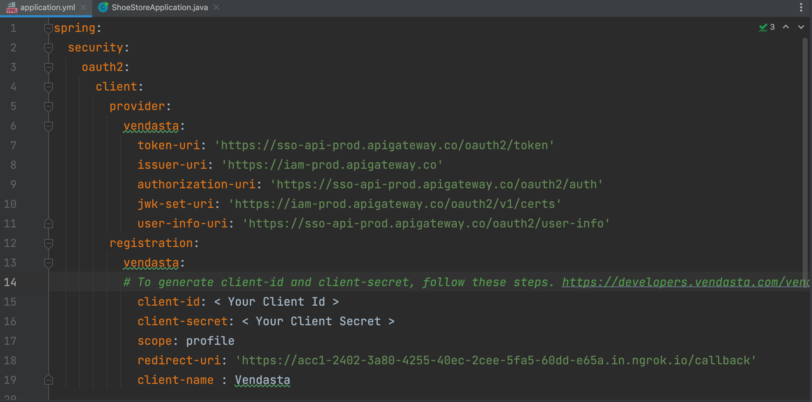
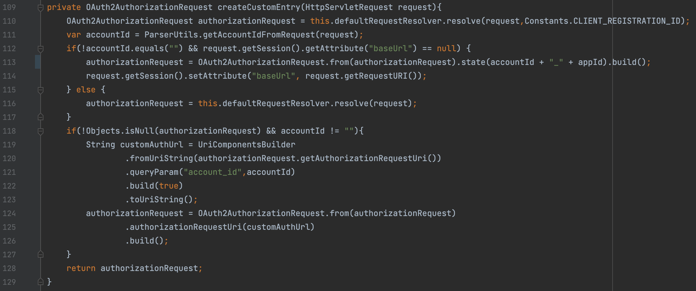

# Creating New Vendor Application

This guide aims to help you learn how to build marketplace applications. By the end of this article, you will understand how to build and integrate SSO into your marketplace application.

[Spring](https://spring.io/projects/spring-boot) comes with some handy packages which makes your backend application [OAuth2](https://oauth.net/2/) compliant with few steps. Let's dive into creating a simple Spring Boot app.

### Step 1 - Create a spring boot app with OAuth2 (3 Legged OAuth)

You can use the spring initializer to create simple spring boot app with oauth2 client enabled and have thymeleaf added - https://start.spring.io

Below are the required dependencies. We’ve used Maven as the build tool. You can choose Groovy or any other tool you’d prefer. It's up to you!

### Step 2 - Create a Vendor app with Vendasta

 Follow this [guide](https://developers.vendasta.com/vendor/d191b96068b71-sso-o-auth2-3-legged-flow) to create a simple vendor app which has oauth2 enabled and keep your client id and client secret safe.

Once the app is created and ready to use, test from local machine use [ngrok](https://ngrok.com/) to obtain a public uri. It's a reverse proxy which can expose your local development server.

### Step 3 - Updating the spring boot configuration file

 Update your application.yml file with the settings that you got from step 2 as below

### Step 4 - Adding basic oauth configurations

Lets add a simple oauth2 configuration in a configuration file as below

Above configuration code is adequate to load a simple spring boot app with oauth2 enabled (This is how you can also add Google, Github, LinkedIn, and Okta as auth providers). But the only problem is the contextualized parameter. This is explained in detail [here](https://developers.vendasta.com/vendor/d191b96068b71-sso-o-auth2-3-legged-flow#contextualizing-your-authorization-urlrequired).

Vendasta users may belong to any one of our many partners, and each partner may select one of several login methods. Additionally, end user access is white-labeled. The branding to be displayed to the user could depend on the `market_id` of the Account. Thus in order to direct the user to the login screen that is specific to their account, we need to know which account they are attempting to access. Before initiating an SSO with Vendasta, you need the account group id or the partner id that should be tagged to the authorization url.

Most OAuth2 libraries will allow you to add additional context to your Authorization URL with query parameters(though in some cases you may need to do this manually, or extend your library). Before initiating an OAuth2 flow, provide options to your OAuth2 library to set the account ID to the `account_id` query parameter.

The next steps are for doing that.

### Step 5 - Tagging the account group id or the partner id to the auth url

Lets add a custom AuthorizationRequestResolver to our authorization endpoint like so

We have added the authorizationEndpoint to override the default behavior of our auth endpoints. This comes with a handy authorizationRequestresolver option to use a CustomRequestResolver.

We use a parameterized constructor to send both the clientRegistrationRepository(Ideally stuff from your application.yml file) and the authorizationUrl that we want to override. So lets go ahead and create our class

Let's create a class variable called defaultRequestResolver of type Oauth2AuthorizationRequestResolver to get the default configurations and during the constructor initialization, let's initialize this variable with the clientRegistrationRepo for vendasta and the auth url which was hardcoded from the previous step.

The class should implement the Oauth2AuthorizationRequestResolver so that means we need to implement the resolve methods. But since we are only interested in integrating Vendasta as the provider let's use the same logic for both the overridden overloaded methods(That’s a mouthful huh!! Welcome to java) . 

Let's create a method `createCustomEntry` to take care of this activity.

The method does a lot of things and it could be engineered better, but to make it screenshot friendly, we have made everything available here. Let's look at what’s happening here

1. Let's call the resolve method of the default implementation of this class by spring boot . (We need this because we need various configuration setup like adding the clientRegistrationId,state,redirectUrl and such. lets create a temp Oauth2AuthorizationRequest.

2. The second line  gets the accountId from the request Url(This is a mandatory step when integrating with Vendasta. When creating the entry Url , The accountId should be tagged in the format `/entry/accountId` for it to work properly. This is explained better in the docs above.

3. The next if statement will make sure that we redirect the user to the right location after the login. This also works hand in hand with another problem. That is to look for an active session with the client. If there is no active session with the client then this variable is null. So the auth flow happens only when there is no valid sessions. 

4. The next line sets the accountId in the `state` parameter of your authUrl.

5. We then set the callback url here using a session variable called `baseUrl` ( This is purely optional. An authenticated session can be validated a number of ways. We are using a simple session variable. On successful validation from Vendasta we get a request to the redirect Url . Since we don’t want to send the user to the redirect url always we use this variable. Let's look at this implementation later

6. if the baseUrl already has a valid session then we just enter into the else part and make the object authorizationRequestResolver as `null` because we don't want to trigger an auth flow once authorized.

7. The next few lines are self explanatory. They add the accountId to the `authUrl`. Our final Url would look something like this.

This is the logic for `getAccountIdFromRequest` method 

### Step 6 - Adding a custom Success Handler to capture the redirect Url 

The final addition to the chain will look something like this

We provide a redirection endpoint and a custom success Handler

The logic of the custom handler is simple and cute. 

We check if the request is from the `/callback` endpoint we configured in Vendasta and then we check the session param that was added before to get the baseUrl. We also add the accountId that we got from the state param. That's it. We create a landing page for `/accountID` and we are done.

### Step 7 - Landing page controller

Let's write a simple html page using thymeleaf

Add a simple controller like so -

You should be able to login to the app. As soon as you hit the entry url you should be directed to the Vendasta application login page and once you login you should get the below screen.

That's it. You are done!! You are now successfully authenticated with the Vendasta 3-legged OAuth process. You can get the complete code sample for the Marketplace application with 3-legged([SSO](https://developers.vendasta.com/vendor/d191b96068b71-sso-o-auth2-3-legged-flow)) and 2-legged ([Partner Platform Api](https://developers.vendasta.com/platform/ZG9jOjEwMTkzMDg4-overview)) OAuth2 processes from this [link](https://github.com/vendasta/api-gateway-docs/tree/master/examples/spring-boot/marketplace-app).

### Related Links

Here are some useful links for the deep dive:

- Implementation of 3-legged OAuth with Spring-boot - [Video](https://drive.google.com/file/d/15taDril9zlGkI1aGMxrW7C2g0JLYJQXA/view)

- Spring-boot code example - [Git](https://github.com/vendasta/api-gateway-docs/tree/master/examples/spring-boot/marketplace-app)

- Running Maven Application - [Docs](https://docs.spring.io/spring-boot/docs/current/reference/html/using.html#using.running-your-application)

- Running Tests - [Docs](https://baeldung.com/maven-run-single-test)
