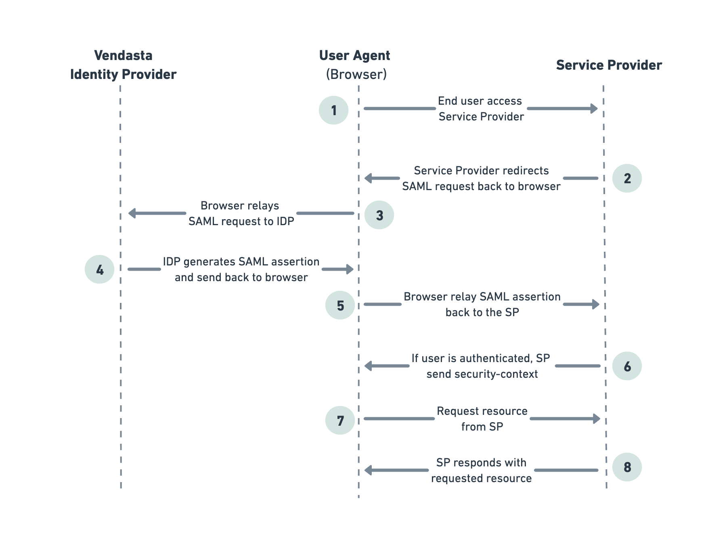
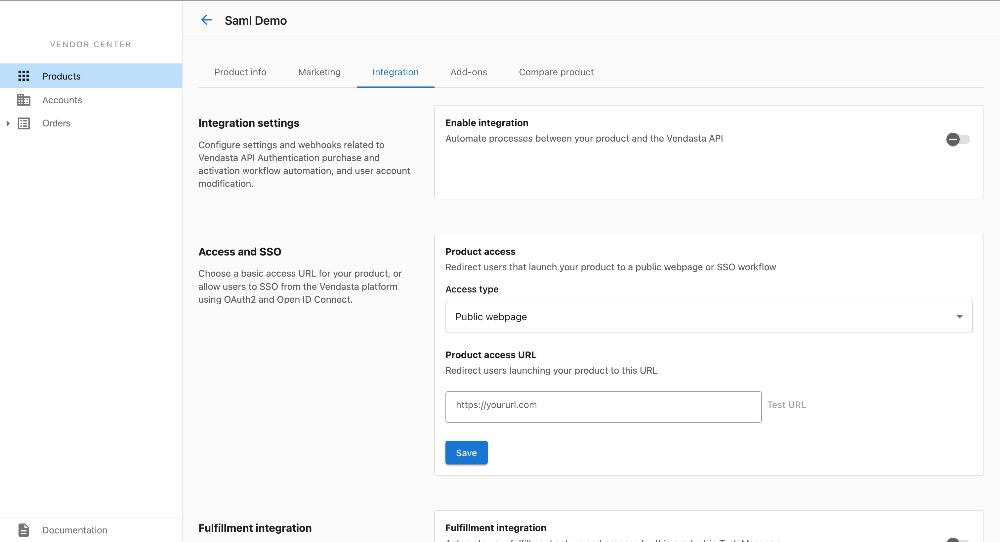
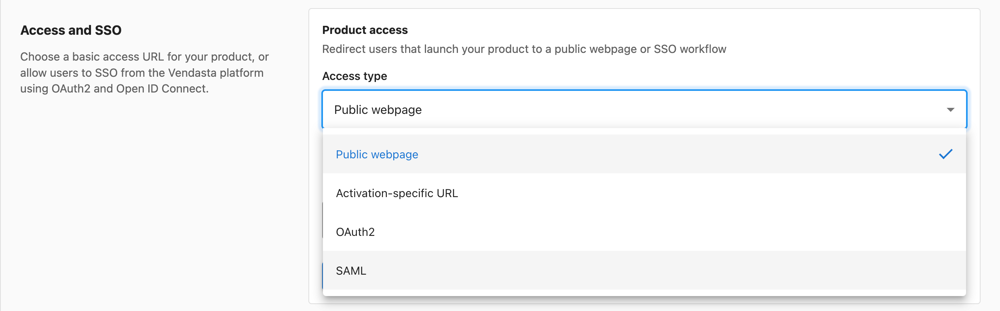
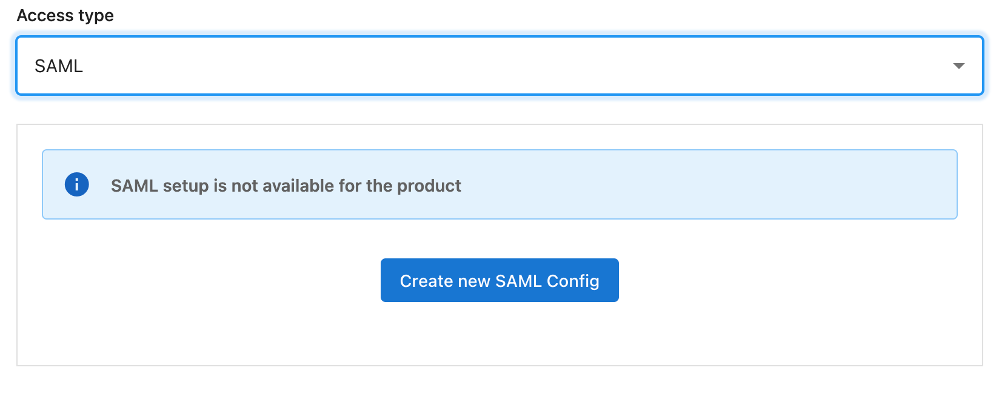
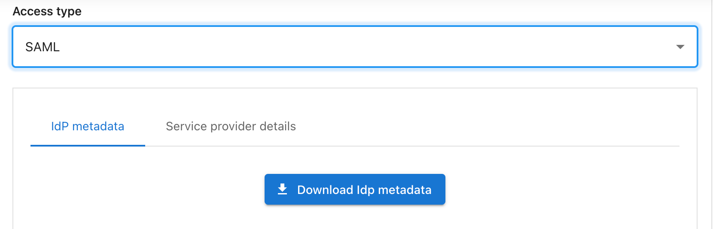
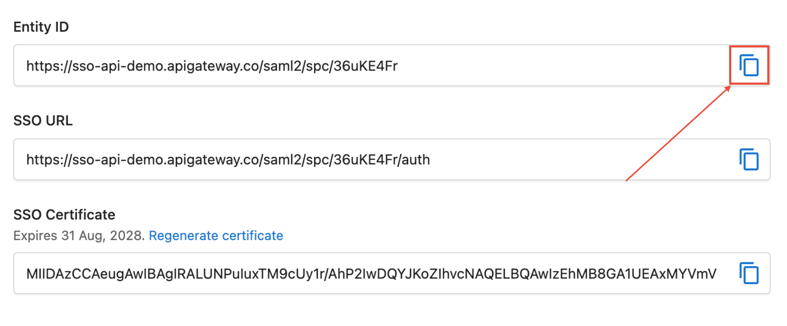
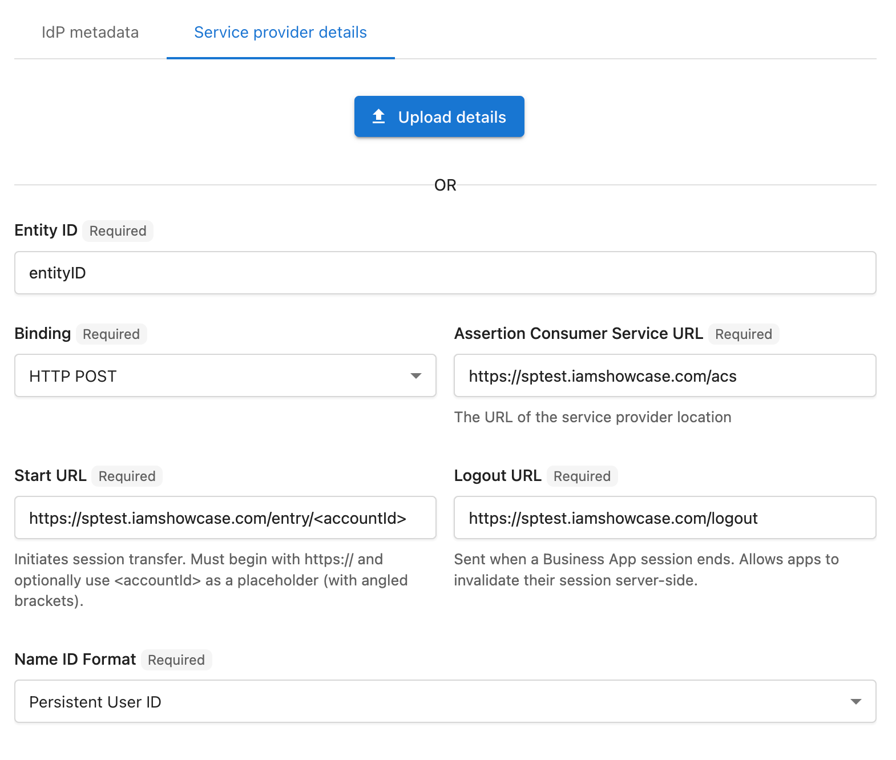

# Guide to Setup SAML SSO

This guide aims to provide a step-by-step walkthrough for configuring [SAML](https://docs.oasis-open.org/security/saml/v2.0/saml-core-2.0-os.pdf) Single Sign-On (SSO) using Vendasta as the Identity Provider (IDP). SAML, which stands for **Security Assertion Markup Language**, is a widely used standard for enabling single sign-on and identity federation across different web applications. Before we dive into the configuration process, let's understand some key technical terms related to SAML.

## Technology Review:
### Key Terms:

1. **Service Provider (SP):**

    - The Service Provider is the application or system that users want to access after a successful SAML SSO. In our case, it's your marketplace application.

2. **Identity Provider (IDP):**

    - The Identity Provider is the system that authenticates users and provides identity information to the Service Provider. Vendasta will serve as your Identity Provider in this setup.

3. **Metadata:**
    - Metadata in the context of SAML refers to XML documents that contain important configuration information about either the Identity Provider (IDP) or the Service Provider (SP). These documents serve as a way for these entities to exchange critical information required for successful SAML-based single sign-on (SSO).

    - **IDP Metadata:** The IDP metadata typically contains information about the Identity Provider, including its entity ID, SSO and Single Logout Service URLs, and its public key for signing SAML assertions. The Service Provider can consume this metadata to configure its SAML SSO settings correctly. IDP Metadata will look like the below example:
```xml
<EntityDescriptor xmlns="urn:oasis:names:tc:SAML:2.0:metadata" entityID="https://sso-api-demo.apigateway.co/saml2/spc/oWw1OqV" validUntil="2024-09-11T04:57:03.170901138Z" cacheDuration="31536000000000000">
  <IDPSSODescriptor xmlns="urn:oasis:names:tc:SAML:2.0:metadata" protocolSupportEnumeration="urn:oasis:names:tc:SAML:2.0:protocol">
    <KeyDescriptor use="signing">
      <KeyInfo xmlns="http://www.w3.org/2000/09/xmldsig#">
        <X509Data xmlns="http://www.w3.org/2000/09/xmldsig#">
          <X509Certificate xmlns="http://www.w3.org/2000/09/xmldsig#">MIIDAjCCAeqgAwIBAgIQPrA/JUkXbzdXMYLJ3lpqRMSEwHwYDVQQDExhWZW5kYXN0YSBJRFAgQ2VydGlmaWNhdGUwHhcNMjMwOTExMTA1MTI3WhcNMjgwOTExMTA1MTI3WjAjMSEwHwYDVQQDExhWZW5kYXN0YSBJRFAgQ2VydGlmaWNhdGUwggEiMA0GCSqGSIb3DQEBAQUAA4IBDwAwggEKAoIBAQC1hUlVGu2y/rG8b1O5ccrynrsy0uxUBB9TsOZBeC9nLhNB6NqE7AvqMxRYg1xIC8l+nApA4xTSH6L8p0EETjb8aiw26XfjWDVX3p+ZJVAatwX5r81gjQm3jYWuuO6YRVymp+JLjvrcidk1YrWr4okqQ8xrngIITR8OJ4gIvwnRttovvNgSJNgJ2A34alcNNJzDcQTViGSiYtnnztCe9f3S9PcVEXljyWT5LTUOLrewKInhpuBgiUgEzVNFsA0T7RZk0MahnkHmB8xCiVVpe8vA13/XKoDxm900cdx9UL60ceeJ7UXw1Tlj9vnf6ouh0Ll+EKEAE3vG0VUn9NLiijW5AgMBAAGjMjAwMA8GA1UdEwEB/wQFMAMBAf8wHQYDVR0OBBYEFFEmAgF7XMFD/mYRTd9mjl7v7vpMMA0GCSqGSIb3DQEBCwUAA4IBAQAkjnwlWbPqFtBUPYkJ/lmAIcqZlpvAG96+BsABBxPXQ3qzEMpKspBcUXDyEeE+br1rsiTQdCiSQBQOPKknzht/IN6Dm5+0kSnJn1yRdHgsAmceGKGAV83QTIJtifSMnojwr8SyJwILSSkzJ672ilcGhYnrrFQkri91PMab+XrcGfmjzbnfvy85fwJnWUpE2hnvawnZc1YyR2Y6MERyP2V6H/H2Ma2PvZNUtmOOoo6AZx2tQq+UCbcYmLpKlzdTGM5SlrDviToBF+5rpQmUaCvk8jXJQQDXlNN+WxytL5/bet7MKWSSxckTs5SznkcX8HYdFw</X509Certificate>
        </X509Data>
      </KeyInfo>
    </KeyDescriptor>
    <SingleLogoutService Binding="urn:oasis:names:tc:SAML:2.0:bindings:HTTP-Redirect" Location="https://sso-api-demo.apigateway.co/saml2/logout"></SingleLogoutService>
    <NameIDFormat>urn:oasis:names:tc:SAML:1.1:nameid-format:unspecified</NameIDFormat>
    <NameIDFormat>urn:oasis:names:tc:SAML:1.1:nameid-format:emailAddress</NameIDFormat>
    <NameIDFormat>urn:oasis:names:tc:SAML:2.0:nameid-format:persistent</NameIDFormat>
    <SingleSignOnService Binding="urn:oasis:names:tc:SAML:2.0:bindings:HTTP-Redirect" Location="https://sso-api-demo.apigateway.co/saml2/spc/oWw1OqV/auth"></SingleSignOnService>
    <SingleSignOnService Binding="urn:oasis:names:tc:SAML:2.0:bindings:HTTP-POST" Location="https://sso-api-demo.apigateway.co/saml2/spc/oWw1OqV/auth"></SingleSignOnService>
  </IDPSSODescriptor>
</EntityDescriptor>
```
  - **SP Metadata:** Similarly, the Service Provider can also have its own metadata document that describes its configuration, including its entity ID, ACS URL, and public key. The Identity Provider can use this metadata to configure its settings when establishing trust with the Service Provider. SP Metadata will look like the below example:
```xml
<md:EntityDescriptor xmlns:md="urn:oasis:names:tc:SAML:2.0:metadata" xmlns:ds="http://www.w3.org/2000/09/xmldsig#" entityID="IAMShowcase" validUntil="2025-12-09T09:13:31.006Z">
  <md:SPSSODescriptor AuthnRequestsSigned="false" WantAssertionsSigned="true" protocolSupportEnumeration="urn:oasis:names:tc:SAML:2.0:protocol">
    <md:NameIDFormat>urn:oasis:names:tc:SAML:1.1:nameid-format:unspecified</md:NameIDFormat>
    <md:NameIDFormat>urn:oasis:names:tc:SAML:1.1:nameid-format:emailAddress</md:NameIDFormat>
    <md:AssertionConsumerService Binding="urn:oasis:names:tc:SAML:2.0:bindings:HTTP-POST" Location="https://sptest.iamshowcase.com/acs" index="0" isDefault="true"/>
  </md:SPSSODescriptor>
</md:EntityDescriptor>
```
4. **Entity ID (Entity Identifier):**
    - Entity ID is a unique identifier for a service provider (SP) or identity provider (IDP) in the SAML ecosystem. It's often represented as a URL, which helps identify the participating parties in the SAML SSO process.

Simplified explanation of the SP-initiated flow of SAML using Vendasta as the Identity Provider (IDP):



1. The process begins when the end user (usually an employee or customer) attempts to access a resource or application hosted by the Service Provider (SP). 

1. The SP generates a SAML authentication request, which is essentially an XML document. The SP sends this SAML request back to the user's web browser, which then acts as a messenger. 

1. The browser redirects itself to the Vendasta Identity Provider. At the IDP (Vendasta), the user's identity is verified. This can involve traditional username and password authentication or using Google Login.

1. Upon successful user authentication, Vendasta's IDP creates a SAML assertion. This is another XML document that contains details about the user, such as their identity and any additional attributes or roles.The SAML assertion is sent back to the user's browser, which then sends it back to the original SP. This relayed data essentially confirms that the user has been authenticated by Vendasta's IDP.

1. The SP receives the SAML assertion and validates its authenticity. It checks whether the assertion is signed correctly by the trusted IDP (Vendasta) and whether it hasn't been tampered with during transmission.

1. If the SAML assertion is valid and the user is indeed authenticated, the SP establishes a security context. This context serves as proof that the user is authorized to access the requested resource.

1. With the security context in place, the user can now request access to the specific resource, whether it's a web page or any other protected asset hosted by the SP.

1. The SP checks the security context and user permissions to determine whether the user should be granted access to the requested resource. If authorized, the user is given access, and they can use the resource as intended.

This completes the SP-initiated SAML flow using Vendasta as the IDP, allowing the user to seamlessly access the desired resource after successful authentication.

Now, let's proceed with the steps to configure SAML SSO with Vendasta as the IDP for your marketplace application.


## Step 1 - Navigate to Integration tab to Configure SSO

  
> **Access Vendor Center** by logging in directly in at https://vendors.vendasta.com, or navigate from Partner Center using the top navbar App icon beside your name.

Products **→** (Choose a product that you want to configure) **→** Integration

If you don’t have any products yet, follow this [guide](https://developers.vendasta.com/vendor/112210c5ddd88-configuring-your-products-and-services#product) to create one.



Change the Access type to SAML by selecting it from the dropdown menu under Access and SSO section.



## Step 2 - Create SAML Service Provider Configuration 

Click the **Create new SAML** Config button to create a new configuration for your product. After the successful creation of the configuration, you can see two new sections: *IdP metadata* and *Service provider details*.




## Step 3 - Download or Copy IdP Metadata
To configure IDP details in your application, you need IDP metadata. There are two ways to obtain IdP metadata.

1. Click the **Download IdP metadata** button, which is accessible under the IdP metadata tab. This will download the metadata as an XML file.



2. By clicking the copy icon in each field, you can manually copy the Entity ID, SSO URL, and SSO Certificate.




There is an option to regenerate certificate in the SSO Certificate field. By clicking this, you will be able to renew your certificate whenever you need it.

## Step 4 - Configure your Service Provider Details

Switch the tab by clicking **Service provider details**. You can configure your service provider by uploading your metadata file or by manually entering the details.



1. **Using Metadata File:**
    Use the Upload details button on the Service provider details tab to upload your service provider metadata XML file. The file you are uploading should be a valid XML file, and the structure of your metadata should follow the guidelines in this [manual](http://docs.oasis-open.org/security/saml/v2.0/saml-metadata-2.0-os.pdf).

2. **Using Form Fields:**
    Under the upload button, there is a set of input fields where you can manually configure your service provider.

|                                             |   | 
|---------------------------------------------|----------------------------|
| **Entity ID:** | Specifies the SAML configuration's unique identifier. |          
| **Binding:** | The only binding type supported by Vendasta at the moment is HTTP POST. |  
| **Assertion Consumer Service URL:** | After successful login, a POST request will be sent to this URL. |
| **Start URL:** | The entry URL of the service provider, which initiates the SAML SSO flow. You can also use <accountId>, which is an optional placeholder to bind account ID. |
| **Logout URL:** | When a Business App session ends, the user is directed to this URL. |
| **Name ID Format:** | There are two types that Vendasta currently supports.<ul><li> Persistent User ID - Vendasta's user ID will be provided in the SAML assertion.</li> <li> Email Address - User's email address will be provided in the SAML assertion. <br> **Note**: This option can not be used for products distributed in the marketplace.</li></ul> |


Once you've finished configuring, click the **Save** button. That's all. SAML SSO is now available for your application.

## Testing
1. [Publish](https://developers.vendasta.com/vendor/112210c5ddd88-configuring-your-products-and-services#publishing) the product you configured for SAML sso using the status column in the Vendor Center Products list so it can be interacted with in Partner Center
2. [Create an Account](https://support.vendasta.com/hc/en-us/articles/4406959813911) in Partner Center for testing with.
3. [Activate the product](https://support.vendasta.com/hc/en-us/articles/4406958134807) on an Account. This will give you access to the v1 Marketplace API for this `account_id`
4. Access the Business App for this Account. This can be done via the kabob menu on the Account List, or by using the 'Open in' dropdown in the top right of the Account Details page.
5. Click on the icon of the product on the left nav to redirect to your `Entry Url`. Check the 'My Products' page if it's not in the left Nav as there may be enough products active that it wasn't automatically pinned.


