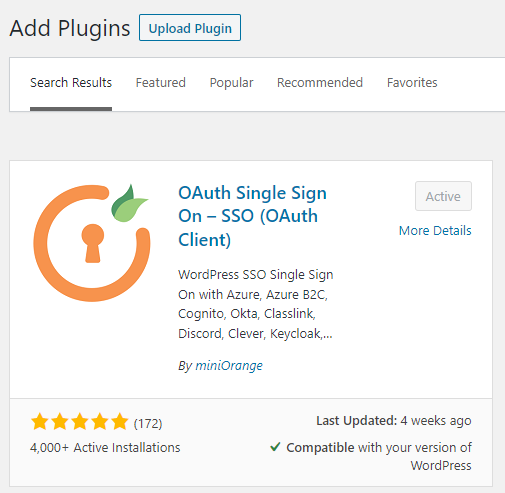
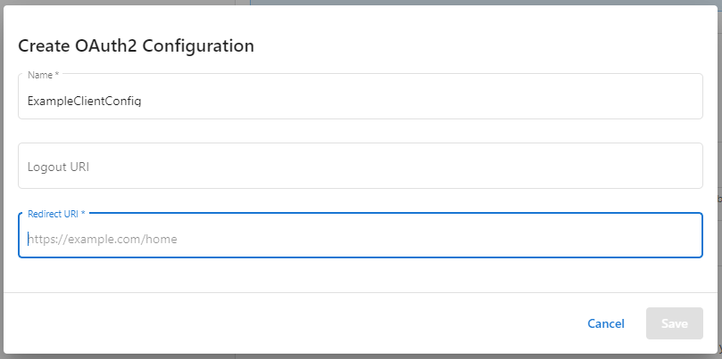
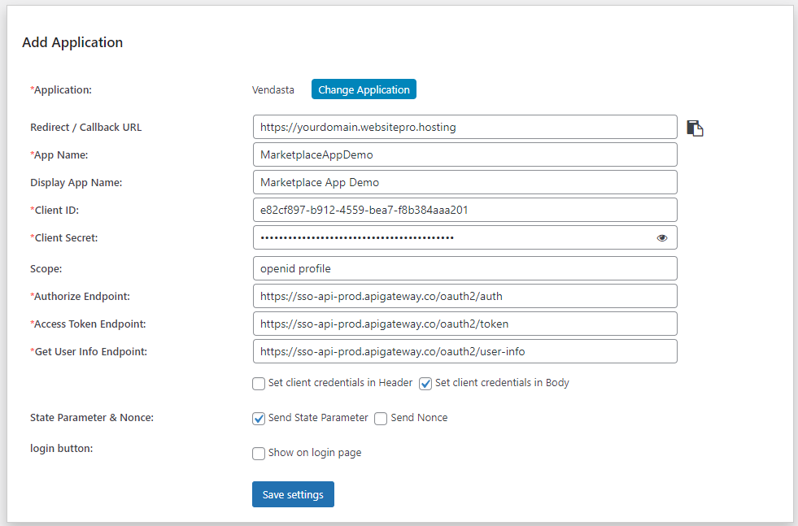
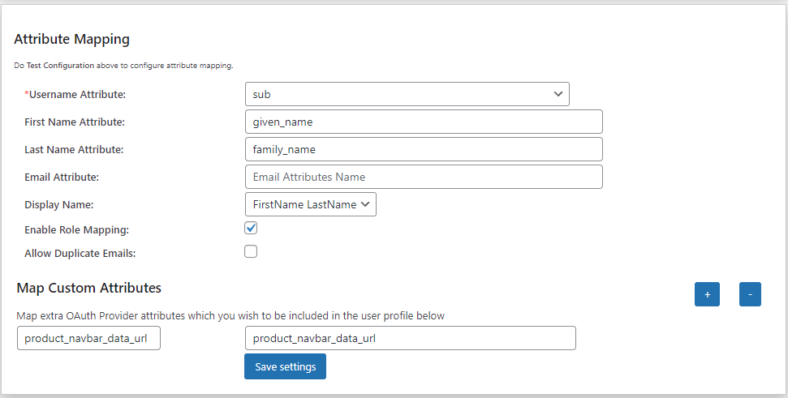
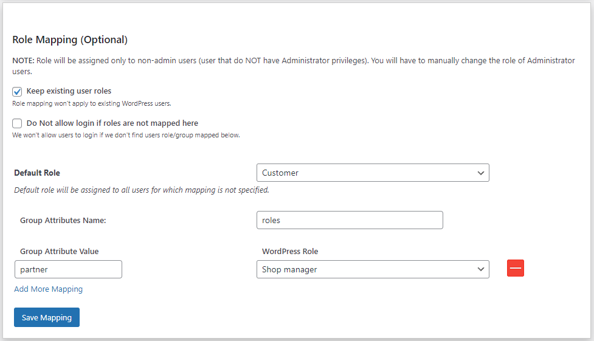
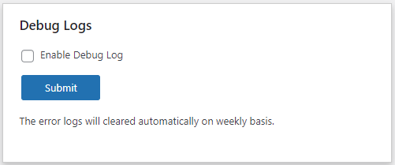

# miniOrange Service Provider Wordpress Plugin

This Guide covers OIDC/OAuth2 SSO from a Vendasta Product into a Wordpress hosted webapp, where Vendasta is the OpenID Provider(OP)/Identity Provider(IDP), and the product the Relying Party(RP)/Service Provider(SP). If you are looking for a guide on executing OAuth SSO from a Wordpress App into Vendasta, please review MiniOrange's [Server guide for Vendasta](https://plugins.miniorange.com/vendasta-sso-using-wordpress-as-oauth-server) & Vendasta's [IDP SSO Guide](https://developers.vendasta.com/platform/ZG9jOjQ4NDkwNDQ2-identity-provider-idp-sso)

## Requirements

**Installation**
* Log into your WordPress instance as an admin.
* Go to the WordPress **Dashboard -> Plugins** and click on **Add New**.
* Search for: "*OAuth Single Sign On – SSO (OAuth Client)*", and click on **Install Now**.
  * OR if you're having trouble finding it download from [here](https://wordpress.org/plugins/miniorange-login-with-eve-online-google-facebook/), and select 'Upload Plugin'

* Once installed click on **Activate**.

**Purchase**

You will need to create a miniOrange Account. Once done, you will be prompted to enter in a key. **You need either the `Enterprise`, or the `All-Inclusive` plan or trial to unlock the needed features for using the miniOrange plugin to integrate with Vendasta.**

## Setup your product OAuth Client

If you haven't created your product yet, create a product in [Vendor Center](https://vendors.vendasta.com). You will need to navigate back to your product to configure your redirect uri during the plugin setup.

**1) In Wordpress:**

1) Navigate to the miniOrange OAuth plugin, and select `Add New Application` to get started. You will need to be logged in and have some sort of plan or trial active.
2) Find Vendasta in the list of providers. The default OAuth 2.0 & OIDC options won't work due to the need for custom url parameters to be passed to the Authorization URL.
3) Copy your callback url(redirect uri)

**2) In Vendor Center:**
1) Navigate to the Integration Page
2) Under Access and SSO-->SSO settings, toggle on Enable SSO
3) Under OAuth2 Configuration select 'Create Configuration'
4) Enter in an Identifying name in case you have multiple products, and paste in the callback url you copied from the miniOrange setup wizard.
    
5) After saving a modal will appear with your client_id and client_secret. **SAVE YOUR CLIENT SECRET someplace secure. If you do not record it now, you will need to delete your client and generate a new one.**

**3) In Wordpress**

Go to the Vendasta Developer Center [Service Configuration](https://developers.vendasta.com/vendor/d191b96068b71-sso-o-auth2-3-legged-flow#library-or-service-configuration) section of the SSO page to find the details required for the remainder of the miniOrange setup wizard.

1) Set your AppName. We suggest you match your miniOrange app and Vendasta product client names to keep things organized. *Note - you will need this name when configuring your Entry URL in Wordpress in later steps*
2) Copy in your client_id & client_secret that you got when generating your Product's OAuth client in Vendor Center. 
3) Copy in the Authorization, Token, and Get User Info endpoints from the service configuration url table in the Vendasta OAuth guide. **Exclude the '?account_id=<account_id>' placeholder for the authorization url. Authorization URL param appension is supported by miniOrange, but needs to be initiated by your App's Entry URL, which will be covered later in the guide.**
    
4) Save your settings - a few more fields will become available on the Update Application screen.
5) Add the JWKS URL
6) Alter the checkboxes if needed:
    1) Set 'Send client credentials in' to `Body`
    2) Uncheck 'Show on login page'

Don't forget to save your settings.

## Configuring the MiniOrange Plugin

You will likely want to update your miniOrange application to include User Attribute Mapping, and optionally Role Mapping.

**User Attribute Mapping**

Users will be created Just in Time(JIT)

_*note that you turn on Role mapping within Attribute Mapping_

Above is an example configuration. Vendasta's OAuth implementation doesn't support the `email` attribute. The Vendasta user_id is specified as the `sub` in the id token, and user info endpoint response.

**Role Mapping**

1) Set the Group Attributes Name to `roles`
2) Map any desired roles. See [User management](https://developers.vendasta.com/vendor/d191b96068b71-sso-o-auth2-3-legged-flow#user-management) for role details.

## Product Entry URL

This url acts as the entry point for the product. It could be redirected to from various dashboards or emails. Prior to redirect the account_id is injected into the placeholder on the url, and should be appended as an additional url parameter on the Authorization URL to trigger the start of the session transfer. See [Contextualizing your Authorization URL](https://developers.vendasta.com/vendor/d191b96068b71-sso-o-auth2-3-legged-flow#contextualizing-your-authorization-urlrequired).

### Configure the Entry URL in Wordpress

There are many tutorials available on how to register endpoints in Wordpress. The simplest methods would be to use a plugin, or to edit your child theme's functions.php file. For ease of demonstration, this POC uses the latter option.

**Step 1) Register the route**

Use the Wordpress add_action function to register a route:

```php
add_action( 'rest_api_init', function () {
	register_rest_route( 'ssodemo', '/entry_url/', array(
		'methods'  => 'GET',
		'callback' => 'entry',
	) );
} );
```
Whatever route you define is what you will register in Vendor Center:

<!-- theme: warning -->
>The Entry URL supports the `<accountId>` placeholder being anywhere, but for this integration, it needs to be implemented as a url parameter, with the key specified as `account_id`

**Step 2) Define some constants**

Define some constants at the top of your file for your host, and miniOrange appName. Your appName is found in the miniOrange plugin application list - see [How to get the application name](https://developers.miniorange.com/docs/oauth/wordpress/client/miscellaneous-info#getting-application-name)

```php
define(SITE_URL,get_site_url());
define(MINIORANGE_APPNAME, "MarketplaceAppDemo");
define(MINIORANGE_REDIRECT_URI, "https://wintzell-s-oyster-house.websitepro.hosting");
```

**Step 3) Add the entry function**

The entry function will pull the account_id from the Entry Route, build the miniOrange IDP login link, appending the `account_id`, and use it to retrieve the OAuth Authorization url. The parse_response function will extract the Authorization url from the Link Login url response, then finally we redirect to the Authorization url.

```php
/**
 * Routes through sso before redirecting user to requested resource
 * Uses MiniOrange SSO Client plugin
 * @param array $args to capture account_id from Entry URL
 * @return string
 */
function entry( object $args ) {
	$account_id = $args['account_id'];
	$idp_entry = SITE_URL . "?option=oauthredirect&app_name=" . 
		MINIORANGE_APPNAME . "&redirect_url=" . MINIORANGE_REDIRECT_URI
		. "&account_id=" . $account_id;
 	$response = wp_remote_get($idp_entry);
 	$body     = wp_remote_retrieve_body( $response );
 	$auth_url = parse_response($body);
	wp_redirect( $auth_url );
	exit;
}
```


MiniOrange does have [a filter](https://developers.miniorange.com/docs/oauth/wordpress/client/wordpress-hooks) for altering the Authorization URL in flight. However, they suggest for Vendasta's use case that their Identity Provider Initiated SSO should be utilized.

Here are the instructions for the [Link Login option](https://developers.miniorange.com/docs/oauth/wordpress/client/login-options#link-login):

This link is in the format:
```<your-wordpress-site>?option=oauthredirect&app_name=<application-name>&redirect_url=<redirect-url-of-your-wordpress-site>&additionalparams=xxx```

Where `<your-wordpress-site>` is your WP domain, `<application-name>` is the application that would be created in the OAuth Client plugin on WordPress, and `<redirect-url-of-your-wordpress-site>` will be the WP site link where the user will be redirected after the SSO.

```php
/**
 * We are using the miniOrange Link Login Option to trigger IDP initiated sso
 * This function will parse the response from the login link to extract the authorization url
 * @param string $response the link response includes the authorization url and it's length as a string
 * @return string
 */
function parse_response($response) {
  // Find the first and last occurrence of quotation marks in the response
  $first_quote_pos = strpos($response, '"');
  $last_quote_pos = strrpos($response, '"');

  // If the first and last quotation marks are found, extract the string between them
  if ($first_quote_pos !== false && $last_quote_pos !== false) {
    $parsed_response = substr($response, $first_quote_pos + 1, $last_quote_pos - $first_quote_pos - 1);
  } else {
    // If the quotation marks are not found, return the original response
    $parsed_response = $response;
  }

  return $parsed_response;
}
```

## Testing

**Turn on Logging**

Configure miniOrange, and then turn on the logging. There is a Debug Logs tile on the right hand side when editing your miniOrange application:


This will allow you to see exactly how the OAuth flow, and user creation and mappings proceed. Come back to this tile after you've executed a session transfer, and there will be an option to download the logs.

**Testing SSO**

Start testing by using the miniOrange 'Test Configuration' button. This will pop open a window and generate the Authorization url for you. Here's what you would expect: ```string(1028) "https://sso-api-prod.apigateway.co/oauth2/auth?client_id=e82cf897-b912-4559-bea7-f8b384aaa201&scope=openid profile&redirect_uri=https%3A%2F%2Fyourdomain.websitepro.hosting&response_type=code&state=randomjot&account_id="```

Copy the Auth url, and paste the url into your browser, before submitting, add an account_id that your product is currently active on to the `account_id` value, which is left blank.

**Testing the Entry URL**

You can do this manually, but you should ensure you have your Entry URL registered in Vendor Center, and test that the link works properly from Business App. Ensure the product is active on your test account, then [Access Business App](https://support.vendasta.com/hc/en-us/articles/4406958143383), and click on your App icon to redirect to the Entry URL with the `account_id` appended in your placeholder.

<!-- theme: info -->
>*Tip* - Test in a different browser session than where you are editing plugin settings and files from, as you'll gain the permission level of the last user you accessed Wordpress as, including via miniOrange SSO. This keeps you from having to continually re-login as an administrator to be able to edit things.