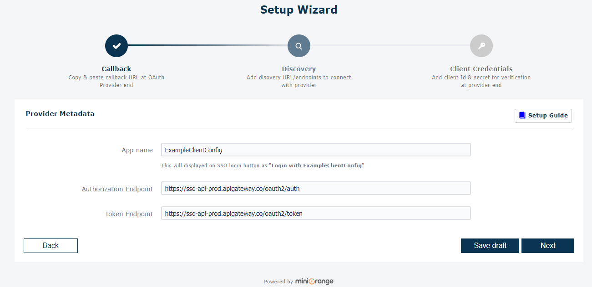
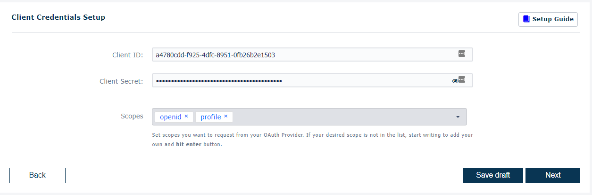
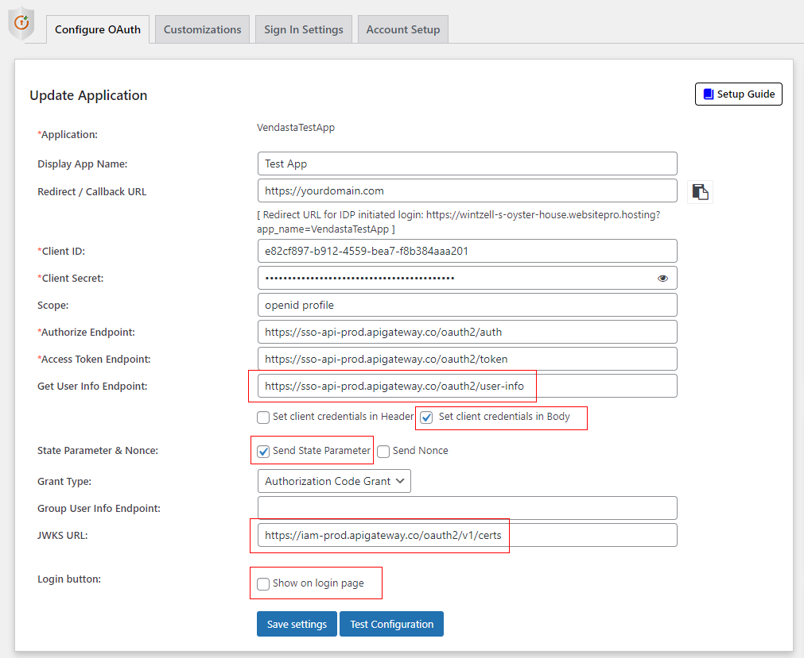

# miniOrange Service Provider Wordpress Plugin

This Guide is for OIDC/OAuth2 SSO from a Vendasta Product into a Wordpress hosted webapp, where Vendasta is the OpenID Provider(OP)/Identity Provider(IDP), and the product the Relying Party(RP)/Service Provider(SP). If you are looking for the reverse instructions on executing OAuth SSO from Wordpress App into Vendasta, please review MiniOrange's [Server guide for Vendasta](https://plugins.miniorange.com/vendasta-sso-using-wordpress-as-oauth-server) & Vendasta's [IDP SSO Guide](https://developers.vendasta.com/platform/ZG9jOjQ4NDkwNDQ2-identity-provider-idp-sso)

## Requirements

**Installation**
* Log into your WordPress instance as an admin.
* Go to the WordPress **Dashboard -> Plugins** and click on **Add New**.
* Search for: "*OAuth Single Sign On – SSO (OAuth Client)*", and click on **Install Now**.
  * OR if you're having trouble finding it download from [here](https://wordpress.org/plugins/miniorange-login-with-eve-online-google-facebook/), and select 'Upload Plugin'

* Once installed click on **Activate**.

**Purchase**

You will need to create a miniOrange Account. Once done, you will be prompted to enter in a key. **You need either the `Enterprise`, or the `All-Inclusive` plan. To proceed**

## 1. Setup your product OAuth Client

If you haven't created your product yet, create a product in [Vendor Center](https://vendors.vendasta.com). You will need to navigate back to your product during the plugin setup.

**In Wordpress:**

1) Navigate to the miniOrange OAuth plugin, and select `Add New Application` to get started
2) Search for Vendasta, if not found, select `Custom OpenID Connect App`
3) Copy your callback url(redirect uri)

**In Vendor Center:**
1) Navigate to the Integration Page
2) Under Access and SSO-->SSO settings, toggle on Enable SSO
3) Under OAuth2 Configuration select 'Create Configuration'
4) Enter in an Identifying name in case you have multiple products, and paste in the callback url you copied from the miniOrange setup wizard.
    
5) After saving a modal will appear with your client_id and client_secret. **SAVE YOUR CLIENT SECRET someplace secure. If you do not record it now, you will need to delete your client and generate a new one.**

**In Wordpress**

1) Go to the Vendasta Developer Center [Service Configuration](https://developers.vendasta.com/vendor/d191b96068b71-sso-o-auth2-3-legged-flow#library-or-service-configuration) section of the SSO page to find the details required for the remainder of the miniOrange setup wizard.
2) Set your AppName. We suggest you match your miniOrange app and Vendasta product client names to keep things organized. *Note - you will need this name when configuring your Entry URL in Wordpress in later steps so keep it handy*
3) Copy in the Authorization and Token endpoints from the service configuration url table. **Exclude the '?account_id=<account_id>' placeholder for the authorization url. Authorization URL contextulaization will be dealt with in later steps in wordpress configuration rather than in the miniOrange plugin.**
    

4) Copy your client_id & client_secret that you got when generating your Product's OAuth client in Vendor Center. 
    
5) On the Wizard Summary review to ensure your entries are correct. 
    <!-- theme: warning -->
    >**Ensure you set 'Send client credentials in' to `Body`, though this can be changed later.**


## Configuring the MiniOrange Plugin

The wizard only helps you configure the core features. You will want to update your application in wordpress.

**Configuration**

Additional items to enter, or configure are highlighted:


**User Attribute Mapping**
Users will be created Just in Time(JIT)


## Setting up Product Entry URL

### Register Endpoint

### Handling custom authentication url params

MiniOrange does have [a filter](https://developers.miniorange.com/docs/oauth/wordpress/client/wordpress-hooks) for altering the Authorization URL in flight. However, they suggest for Vendasta's use case that their Identity Provider Initiated SSO should be utilized.

Here are the instructions for the [Link Login option](https://developers.miniorange.com/docs/oauth/wordpress/client/login-options#link-login):

This link is in the format:
```<your-wordpress-site>?option=oauthredirect&app_name=<application-name>&redirect_url=<redirect-url-of-your-wordpress-site>```

Where `<your-wordpress-site>` is your WP domain, `<application-name>` is the application that would be created in the OAuth Client plugin on WordPress, and `<redirect-url-of-your-wordpress-site>` will be the WP site link where the user will be redirected after the SSO.

To know how to get the application name, please refer the [Misc. Section for How to get the application name?](https://developers.miniorange.com/docs/oauth/wordpress/client/miscellaneous-info#getting-application-name)
For Example: If your domain is miniorange.com, your application name is OAuthApplication and redirect url is https://miniorange.com/single-sign-on-sso this link would look like:
`https://miniorange.com?option=oauthredirect&app_name=OAuthApplication&redirect_url=https://miniorange.com/single-sign-on-sso`


## Configure Entry URL

[TODO] Get best practices on custom code location. May not be in functions.php of child template?

[TODO] Get review of php example code