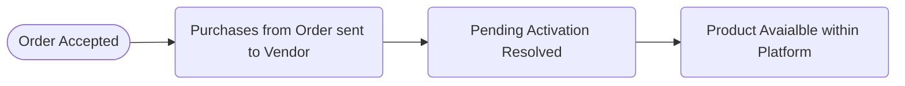

# Provisioning Workflow



## Product Life Cycle

An activation can be in one of 4 states for any given Account:


_*See **Activation Types** below for details on all possible events_

**#1 Purchase Event:** An order has been approved, either automatically or by an Admin user, which triggers the provisioning event sending the configured purchase alerts for the skus purchased to the Vendor. There are multiple ways an activation could be triggered. It may be triggered by either a Reseller Admin, or a user from an end business. [Submitting an order as a Reseller Admin](https://support.vendasta.com/hc/en-us/articles/4406958134807) is the easiest way to test the triggering of a _Provisioning Event_.

**#2 Resolve Pending Activation Event:** Depending on the sku configuration, either Vendasta, or the Vendor confirms that the product is now active by calling the 'Resolve Pending Activation' endpoint in the Accounts API. This can be accomplished automatically via the API, or via the Vendor Center Accounts page -> Pending Activations sub tab(_this is hidden when there are no pending activations_).

**#3 Cancellation Event:** A sku has been canceled for a given Account, and the activation goes into a _Pending De-Provisioning State_. This can be undone if the user changes their mind. Vendors may optionally subscribe to this event.

**#4 Deactivation Event:** A de-provison alert is sent to the Vendor. 
* If the Product is in a pending de-provision state, then the product is fully deactivated at the end of it's billing cycle.
* If the sku _Billing Frequency_ is set to 'One Time', de-provision event occurs immedialty after cancellation event.


<!-- theme: warning -->
>_Please Note:_
>* An Add-on can only be active when its parent Product is active.
>* When a product is deactivated, all of its Add-ons are automatically deactivated. 


## Receiving order & provisioning events
Notification of a purchase and the purchase data included in the message may be received by the Vendor via Webhook AND/OR Email. These notifications are triggered when your Product, or Add-on is activated on an Account

### Email Notification

Purchase notification emails will always be sent to any recipients configured. You may add as many notification recipients as you like:

_Vendor Center -> Product -> Product Info -> Product Activation->Notifications_


Activation email notifications can be sent in conjunction with the webhooks to keep your team in the loop. If your offering has a dashboard, and you are providing SSO it is not recommended to use email as the sole source of your product provisioning as it is a manual process. The email will contain the order form, but doesn't include all of the Account data that the webhook does.

### Webhooks

The Purchase Webhooks will receive the basic data that is available on the Account, as well as the order form data if an order form is configured for the Application.

See the [Webhooks Page](../Other/marketplace_webhooks.md) for details on the payloads.

**Configuration**

Apps & Add-ons have individual Purchase webhooks. Both of these Webhooks are configured on the Integration page of the Parent App. The Cancellation Webhook is an alert only, and no action is expected based on its optional receipt.


## Mapping Accounts

Vendors are responsible for maintaining a mapping between the Vendasta Account, and the equivalent entity on their side.

|Field| Description
| --------------|:----|
|`account-->id`| This is the unique Vendasta ID representing a Vendasta Account(typically an individual business location). There should be a 1:1 relationship between a Vendasta Account and an instance of the Vendor Product. This field has the key 'id', and is found within the account object in the purchase webhook json payload. ```Format: AG-XXXXXXXX``` |
|`activation_id` | This is a unique activation tracking id, it will be required to resolve a Pending Activation.|
|`order_form_submission_id` |This is a unique id for tracking order form data from an Activation.

## Provisioning Workflows

It is recommended that if webhooks are being used to utilize the _Pending Activation Workflow_. If your operations team has to take manual steps to provision the offering, then this flow is **required**.

The `Use "Pending Activation" workflow` checkbox in the _Product activation_ section of the _Product Info_ page shifts the responsibility for activation resolution from Vendasta to the Vendor.

**Manual UI Route**
1) An email with the order details will be sent to all of the email addresses registered in the Notifications --> Recipient Email list.
2) Execute whatever steps are needed to provision product. If you utilize the API or SSO this will involve mapping the `account_id` to the equivilent id for your product.
3) Resolve the pending activation via Vendor Center. _Vendor Center -> Product -> Accounts -> Pending accounts_. *Note that the Pending accounts subtab only appears when the `Pending Activation` workflow checkbox is selected on the product or one of it's Add-ons.

**API Route**
1) When the webhook is received always respond with a 200 indicating a successful response
2) Execute whatever steps are needed to provision product
3) Resolve the pending activation via the _Resolve a Pending Activation` API endpoint in the Accounts API.

</br>

**Full Provisioning Workflow**


## Testing Provisioning

The `action` field on the Purchase Webhook indicates which payload type you are receiving. 

**actions:** _`provision`, `de-provision`, `provisioned-trial`, `change-edition`_

<!-- theme: info -->
>Note that Add-ons only have the _provisioned & de-provisioned_ actions, as they are not compatible with Editons or Trials.

### Initial Testing

Once a value has been entered in the _Integration-->Integration Settings-->Purchase URLs_ a testing tab will appear on the far right for sending mock purchase data to your purchase urls. If you require order form data to provision your sku, you should test the activations from Partner Center, as the mock data will not suffice. 
You can [create](https://support.vendasta.com/hc/en-us/articles/4406959813911) as many test Accounts as you want in Partner Center, and [activate and deactivate](https://support.vendasta.com/hc/en-us/articles/4406958134807) your own offerings as much as you desire.


### Trial Activation
Trials are currently ONLY activated from within in the Business App. 


_A trial may be upgraded to a paid product or edition via either Business App, or Partner Center._

The Vendor is responsible for the trial lifecycle, including:

1. **Behavior after the trial ends.** The product remains accessible after trial expiry to provide flexibility to the Vendor as to how they want to prompt upgrades.
2. Any communications via the [Activity Stream](https://developers.vendasta.com/vendor/ZG9jOjIxNzMyNTMx-activity-stream) with calls to action, informing users of the trials state, when it ends, and encouraging upgrades.


There are two steps to making a trial available to be activated.

1. **_As a Vendor_**, configure the Trial in Vendor Center. This is configured in the _Pricing & Trials_ section in the _Product Info_ tab. 
<!-- theme: info -->
>If your product has editions, let your Vendasta contact know which edition you want to be trialed.

2. **_As a Channel Partner_**, set the Trial to be available in Business App via _Marketplace -> Products -> App -> Product info_:


### Product or Add-on Activation

There are many ways a sku can be activated. For testing purposes, the easiest method is via the Partner Center `Account Details` page:

1. Navigate to [Partner Center > Businesses > Accounts](https://partners.vendasta.com/manage-accounts) and click on the account name.

2. Within the Account Details page - select `Activate Products`


<!-- theme: info -->
>Once Sales Order is completed, and the activation lifecyle begins, if the product has webhooks configured, request(s) will be sent to their respective purchase webhooks with the `provisioned` action.

### Edition Change

The new `edition_id` will be included in the data for whatever purchase notification is configured.


_Edition Change from Partner Center `Account Details` Page_

<!-- theme: warning -->
> Unlike an Activation, an Edition Change can not be rejected at this time. If a 400 error occurs during the Edition Change event, Vendasta and the Vendor will end up out of sync. If this edge case does occur, the Partner and/or Vendor should contact support@vendasta.com

---

**Next:** [Session Transfer](oauth2.md)