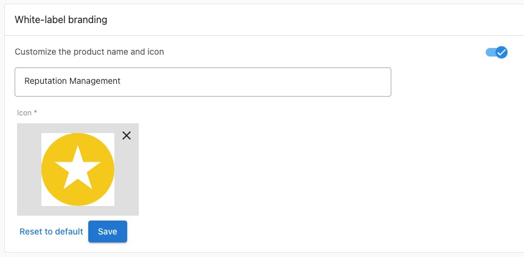

# White-labeling & Branding

## Vendasta's White-labeled Platform

Vendasta is a white-label ready **platform**. There must not be any mention of _‘Vendasta’_ in your content.
You may want to keep the term 'Vendasta' out of your codebase entirely; but if not, aim to avoid mention of Vendasta on anything client-facing - including:
* ALL Product Pages & marketing material
* UI (including dashboard URLs)
* Cookies
* Client side redirects
* Error messages

## Product Branding

We don't require that your products support white-labeling, however, many Vendasta Resellers will take more interest in selling your offerings if they can brand them as their own. If you support branding your dashboard in any way, this guide will go over how you can add support for this to your product, as well as the different types of branding there are. **Only one of the following options should be utilized per sku:**

### Option 1 - Partner Market Branding

You are able to brand your dashboard with the custom logos, colours, and names that the Resellers supply for each of their [Markets](https://support.vendasta.com/hc/en-us/articles/4417442351639). 

The *Account API* [Get Account Settings](https://developers.vendasta.com/swaggerui#/account/get_account__account_id__settings) endpoint provides you with:

* Account Market Name
* Account Market Logo URL
* Account Market Primary Colour(hex)

<!--theme: info -->
> `platform_settings` fields returned by the Account Settings endpoint have their keys prepended by `partner`. Don't be confused by this labeling, these values are **Market** specific!

Most Resellers only have a single Market of key `default`. But to support branding for all Resellers you **must** either store branding information at the Account, or the Market level. You will receive both the `partner_id` and the `market_id` in the provisioning webhook, and they are also returned by the Account GET endpoints.

### Option 2 - Product Branding Override(Beta)

Rather than have their general branding apply to Vendor products Partners may choose to specify custom branding information for each product that supports Product Branding. Partners may apply these customizations for all Markets, or on a **per Market basis**.

This includes:
* Product Name
* Product Logo

**Configuration**

_Vendor Configuration_: While this feature is in Beta, please contact Vendasta to enable this for your sku.

_Reseller Configuration_: 
Left Navigation--> Marketplace --> Products --> Select Product --> Product Info Tab

<!--theme: warning -->
> While in beta, please be aware that there are no Vendor APIs, or Webhooks for this data. It lives only in the Vendasta ecosystem at this time. Thus this feature should only be enabled for your product if your dashboard is grey-labelled, and has no branding in it. **Don't use Product Branding in addition to Partner Branding. Choose one or the other to implement.**