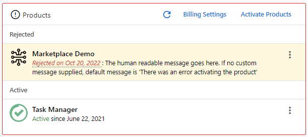

# Overview

All of the webhooks used in the Vendasta marketplace take security and privacy as primary concerns. Thus Marketplace webhooks are sent over HTTPS, and payloads are signed by the Vendasta Marketplace so applications can verify the authenticity of all payloads. In order to make this process secure, extensible, and simple for developers we have chosen to use the [JWT Format](https://jwt.io/introduction/) signed by an RSA key for the Marketplace Webhooks.

## Webhook Registration

Webhooks are registered by placing a url in the Integration page of an App in [Vendor Center](https://vendors.vendasta.com). API registration is not available.

## Webhook Format

**Payload Details**

``` text
content type: text/plain
body: JWT signed base64 string sent as plaintext raw in the POST body
```
Auth0 has libraries for most popular languages to help speed up integrations that interact with JWTs: [https://jwt.io/#libraries-io](https://jwt.io/#libraries-io)


**Testing**

The best way to initially test receiving a webhook payload from Vendasta is to use the Testing Page in Vendor Center. 

The Testing Page will load the **Purchase Webhook** URLs you have entered in the Integration Page by default, but you can set them to whatever url you would like. This tool only sends purchase webhook dummy payloads.

To review a test payload try a webhook testing service like [Webhook.Site](https://webhook.site) or [RequestBin by Pipedream](https://requestbin.com/). Copy the unique url they give, and enter it into the on the testing page, and select "SEND TEST APP WEBHOOK" -
Review the results on the Webhook Tester page. It will have received a dummy payload. To see the contents, place the JWT token into the Encoded text area of the [jwt.io debugger](https://jwt.io). 

_You will see that it indicates that you have an Invalid Signature since no Public Key is in place yet - see Validation below_

If you need to test with custom order form data, you will need to test activate the product within the platform as the testing page doesn't support order forms.

**Validation**

You should always verify that the JWT issuer is 'Vendasta Marketplace', or 'Vendasta Marketplace Test' for webhooks sent using the Vendor Center testing tool. For verifying any JWT's sent to your endpoints by Vendasta, the public key for the Vendasta Marketplace is:

```text
-----BEGIN PUBLIC KEY-----
MIIBIjANBgkqhkiG9w0BAQEFAAOCAQ8AMIIBCgKCAQEAqcJZvV3x8dC3q0Rpsu0M
Qby7z4k+iwKHpxV+rlSa7+jpr/xQknlH7ZrMmlcONCteaIZtk92g+QTOnchE9rIC
06TSoaLcpHpaoIpoeALZrgnIwfMMi/G0gRJ5xjuv6sc3QHsQVGf43ClOISPPoJ4t
91lPX/Gm+PvGHDonMpJZdFZyZRkCqBS/rHur+rwnbn1dcFI6iwzyFrQPMRpHx58W
vgFDy9VsCKypMmv5X6TF4KRMfZRmB+avBRWzp9tficzF9hQm7aekyYstUMm76jwD
uC4SYhRy1dsBQ0S8SgcNQR4hBsx5UxERE8uknBW1TtvoyaqMp/HNWZRCNnuDNcfH
/QIDAQAB
-----END PUBLIC KEY-----
```

You can quickly test whether a token's signature is valid using the [jwt.io debugger](https://jwt.io). Enter the Marketplace Public key into the public key box on the right, and then re-paste the token into the Encode text area. You should see the graphic below change to 'Signature Verified'.


## Error Handling

**Timeout OR 500 level response status**

|Webhook|Timeout |Retry
|:---|:---|:---
|*Purchase Webhooks* | 30s | Backoff time doubles from 30s to a  maximum spacing of one hour(approximate*)
| *All other Webhooks*| 10s | Backoff time doubles from 60s to a  maximum spacing of one hour(approximate*)

If your system is down, the retry mechanism will allow for you to receive the message once it is back up. Otherwise, it will serve to alert you that a problem exists without inundating your endpoint with traffic.


### Provisioning Errors

> **Expected Rejections** - Best Practices
>
>If your App has need to reject an Activation for expected reasons we suggest managing this through the Pending Activation Workflow rather than via the purchase webhook response. Always respond with a 200 to the webhook, and utilize the [Resolve a Pending Activation](https://developers.vendasta.com/vendor/b3A6MTY1Njk0Mjg-resolve-a-pending-activation) endpoint to resolve the activation with a approval or rejection.

**Purchase Webhooks: 500 response status**

Your Notification Recipients don't receive the order email until the activation resolves. In the case of a 500 it doesn't resolve and remains in a pending state, thus the recipients will not receive an email. 
<!-- theme: warning -->
>**You must add appropriate logging, and means of alerting yourself to unexpected failures. Vendasta support will make efforts to ensure your team is informed of activaitons stuck in a pending state, but ultimately this is the Vendor's responsibilty.**

**Purchase Webhooks: 3xx-4xx response status**

For unexpected 3xx-4xx responses there will be no retry for the purchase webhooks. The activation will be resolved as `rejected` and the Partner will be alerted that the activation attempt failed. End Users currently aren't informed of activation failures. 




 If the body of the response of a 300-400 level status is formatted as below we will provide the partner with the human readable message that you specify. 

```json
{
    "error_code": "This is a code that has meaning to you so if we need to ask you questions about a rejection it's easier for you to debug",
    "message": "A message for the developers of Vendasta to help debug what went wrong",
    "human_readable_message": "The text here will be displayed directly to your customer beside the reject date."
}
```


## Webhook List

### Product Purchase Hook

The purchase webhook is called every time billing information about an account changes in regards to your product. The relevant changes are the **provisioned**, **change-edition**, and **de-provisioned** events, which are specified in the 'action' field. Note that the order_form section will be null if no order form is specified for your product.

Details:

- **webhook_id** _An identifier for the webhook describing its function._
- **action** _A description of the action that triggered the webhook being sent._
- **account** _A nested structure representing the business the product has been purchased for including identification, location, and contact information._
- **order_form** _A collection of information added to an order form filled out while purchasing the product. Will be null if the product has no order form specified._
- **partner_id** _A unique id specific to the partner selling to the business account._
- **market_id** _An identifier indicating the area that a partner is marketing to. Usually used to specify different geographic regions._
- **activation_id:** _Unique id specific to each instance of an activated product._
- **order_form_submission_id** _A unique identifier specific to the order form that was filled out. Will be empty if there is no order form.
- **vendor_order_id** _A unique identifier for the order the product was purchased in._
- **edition_id** _A unique identifier for the edition of the product being purchased. Will be empty if product does not have separate editions._
- **app_id** _A unique identifier for the product._
- **variable_price** _A nested structure representing what is being spent on the product at activation._

    We always convert non-USD values to USD. While partners can pay in USD, AUD, or CAD for digital ads and potentially
    other products, Vendasta only pays vendors in USD. The currency related fields below are used to provide transparency
    (to vendors) in cross currency variable priced purchases.

    Received from reseller
  - **value** _The amount of the original spend in cents (or smallest denomination in other currencies), before currency conversion._
  - **currency** _The currency of the original spend._
  - **frequency** _The frequency of the spend value._

    Sent to vendor
  - **converted_value** _The amount of the original spend in cents (or smallest denomination in other currencies) after conversion from the `value`._
  - **conversion_currency** _The currency that the original spend is converted to._
  - **conversion_rate** _The conversion rate used to convert `value` to obtain the `converted_value`._


<!--
type: tab
title: Provision Event
-->

`provisioned` action - SAMPLE DECODED PAYLOAD

```json
{
   "iss":"Vendasta Marketplace",
   "iat":1457560237,
   "exp":1457560297,
   "vendasta.com/marketplace/webhook":{
      "webhook_id":"purchase",
      "action":"provisioned",
      "account":{
         "call_tracking_number":[
            "18005555555"
         ],
         "deleted_flag":false,
         "contact_first_name":null,
         "common_name":[
            "KingMe"
         ],
         "timezone":"America/Regina",
         "work_number":[
            "+1 306-652-5464"
         ],
         "partner_id":"VNDR",
         "id":"AG-M3PB8CJP2J",
         "city":"Saskatoon",
         "zip":"S7M 0X6",
         "market_id":"default",
         "deleted":null,
         "state":"SK",
         "company_name":"King Me Boardgamery and Cafe",
         "latitude":52.1259659,
         "foursquare_url":"https://www.foursquare.com/kingme",
         "service_area_business_flag":false,
         "facebook_url":"https://www.facebook.com/kingmeboardgamery/",
         "tax_ids":[
            "food",
            "restaurants:cafes"
         ],
         "website":"https://www.kingmeboardgamery.com/",
         "rss_url":"http://iamawesome.com",
         "updated":"Mon, 29 Mar 2021 23:25:25 -0000",
         "twitter_url":"https://www.twitter.com/kingme",
         "address2":"42",
         "fax_number":"1800343433258298",
         "contact_email":null,
         "address":"527 20th Street West",
         "youtube_url":"https://www.youtube.com/kingmeboardgamery",
         "instagram_url":"https://www.instagram.com/kingme",
         "key_person":[
            
         ],
         "pinterest_url":"https://www.pinterest.com/kingme",
         "contact_last_name":null,
         "cell_number":"3065555555",
         "customer_identifier":"partners-custom-id",
         "created":"Fri, 17 Jan 2020 17:59:47 -0000",
         "linkedin_url":"https://www.linkedin.com/kingme",
         "longitude":-106.6776856,
         "sales_person_id":"UID-d1985535-f7f2-4529-ab47-2932110c46fe",
         "googleplus_url":null,
         "country":"CA"
      },
      "order_form":{
         "contact_phone_number":"",
         "business_phone_number":"(999) 999-5555",
         "salesperson_name":"Jane Doe",
         "business_account_group_id":"AG-XXXXXXXX",
         "business_name":"Name",
         "business_address":"123 some st, San Francisco, CA, US, 94111",
         "business_website": "https://clientwebsite.com",
         "checbox_question":true,
         "contact_email":"",
         "salesperson_phone_number":[
            
         ],
         "salesperson_email":"person@vendasta.com",
         "contact_name":"",

         "question_number_two":"2",
         "files_for_upload":[
            {
               "name":"uploadedfilename.ext",
               "url":"https://example.com/A%20file%20with%20spaces.ext"
            },
            {
               "name":"uploadedpicturename.jpg",
               "url":"https://example.com/pathtofile/"
            }
         ],
         "drop_down_question":{
            "value":"Yes",
            "label":"Yes"
         },
         "end_user_field_type":{
            "value":"{\"firstName\":\"Rand\",\"lastName\":\"al'Thor\",   \"email\":\"dragon.reborn@gmail.com\",\"id\":\"UID-372e0708-ab65-493f-8d47-665cbca4b65a\"}",
            "label":"Rand al'Thor (dragon.reborn@gmail.com)"
         }
      },
      "partner_id":"WOT",
      "market_id":"Westlands",
      "activation_id":"02e9929d-35f2-4c70-988f-5650b183ef9f",
      "order_form_submission_id":"OFS-9f2e1a82-51d6-4a79-ba4b-a8347de14e53",
      "vendor_order_id":"ORD-XXXXXXXXXX",
      "variable_price":{
         "currency":"CAD",
         "value":14000,
         "frequency":"MONTHLY",
         "converted_value": 10000,
         "conversion_currency": "USD",
         "conversion_rate": 1.4
      },
      "edition_id":"EDITION-123",
      "app_id":"MP-123"
   }
}
```
<!-- theme: info -->
>_Please Note:_
>
>Only core account data is included in the `provisioned` webhook payload. If you need extended account data it can be retrieved via the [Get Account Rich Data](https://developers.vendasta.com/vendor/b3A6MzYxMzM5OTI-get-account-rich-data) endpoint.

<!--
type: tab
title: Edition Change Event
-->

`change-edition` action - SAMPLE DECODED PAYLOAD

```json
{
    "iss": "Vendasta Marketplace",
    "iat": 1457560237,
    "exp": 1457560297,
    "vendasta.com/marketplace/webhook": {
        "webhook_id": "purchase",
        "action": "change-edition",
        "account": {
            "id": "AG-XXXXXXXX",
            ...
        },
       "order_form": {
          ...
        },
        "partner_id": "ABC",
        "market_id": "Saskatoon",
        "activation_id": "02e9929d-35f2-4c70-988f-5650b183ef9f",
        "order_form_submission_id": "OFS-9f2e1a82-51d6-4a79-ba4b-a8347de14e53",
        "edition_id": "newEditionId",
        "previous_edition_id": "formerEditionId",
        "app_id": "MP-123"
}
```

<!--
type: tab
title: De-provision Event
-->

`de-provisioned` action - SAMPLE DECODED PAYLOAD

```json
{
    "iss": "Vendasta Marketplace",
    "iat": 1457560237,
    "exp": 1457560297,
    "vendasta.com/marketplace/webhook": {
        "webhook_id": "purchase",
        "action": "de-provisioned",
        "account": {
            "id": "AG-XXXXXXXX",
            ...
        },
        "order_form": null,
        "partner_id": "ABC",
        "market_id": "Saskatoon",
        "activation_id": "02e9929d-35f2-4c70-988f-5650b183ef9f",
        "order_form_submission_id": "OFS-9f2e1a82-51d6-4a79-ba4b-a8347de14e53",
        "edition_id": "EDITION-123",
        "app_id": "MP-123"
    }
}
```

<!--
type: tab
title: Trial Provision Event
-->

`provisioned-trial` action - SAMPLE DECODED PAYLOAD

```json
{
  "iss": "Vendasta Marketplace",
  "iat": 1617061008,
  "exp": 1617061068,
  "vendasta.com/marketplace/webhook": {
    "account": {
        "id": "AG-XXXXXXXX",
        ...
    },
    "order_form_submission_id": "",
    "vendor_order_id": "O-8447fb46-3d10-496a-bd8b-28041372da55",
    "order_form": null,
    "market_id": "default",
    "previous_edition_id": "",
    "app_id": "MP-c316837acf404de681cd4883331c43ae",
    "edition_id": "",
    "activation_id": "f13da5ec-b89c-4a84-a05a-e47db1b88eda",
    "deactivation_time": null,
    "webhook_id": "purchase",
    "action": "provisioned-trial",
    "activation_time": "2021-03-29T23:36:46.812540727Z",
    "partner_id": "VNDR",
    "addon_id": null
  }
}
```

<!-- theme: info -->
>Trials are only triggered from the Business App currently. See [Provisioning>Trial Activation](https://developers.vendasta.com/vendor/e5a7f08cce1cc-provisioning-workflow#trial-activation) for details


<!-- type: tab-end -->

### Add-Ons Purchase Hook

The Add-ons purchase webhook is called every time billing information about an account changes in regards to the Add-ons for your product. The relevant changes are the **provisioned**, and **de-provisioned** events, which are specified in the 'action' field. Note that the order_form section will be null if no order form is specified for your product.

Details:

- **account** _A nested structure representing the business the product has been purchased for including identification, location, and contact information._
- **order_form** _A collection of information added to an order form filled out while purchasing the Add-on. Will be null if the product has no order form specified._
- **market_id** _An identifier indicating the area that a partner is marketing to. Usually used to specify different geographic regions._
- **addon_id:** _Unique id, specific to the Add-on being activated._
- **activation_id:** _Unique id specific to each instance of an activated Add-on._
- **order_form_submission_id** _A unique identifier specific to the order form that was filled out. Will be empty if there is no order form.
- **variable_price** _A nested structure representing what is being spent on the product at activation. The structure contains values for currency, frequency of billing and the spending amount in cents._
- **webhook_id** _An identifier for the webhook describing its function._
- **action** _A description of the action that triggered the webhook being sent._
- **activation_time:** _The time that an Add-on was or is to be activated. This is to allow for delayed activation._
- **deactivation_time:** _The time that an Add-on should be deactivated in the future. This must be observed and acted on come the given time._
- **partner_id** _A unique id specific to the partner selling to the business account._
- **app_id** _A unique identifier for the product._


<!--
type: tab
title: Add-on Provision Event
-->

`provisioned` action - SAMPLE DECODED PAYLOAD

```json
{  
   "iss":"Vendasta Marketplace",
   "iat":1500498639,
   "exp":1500498699,
   "vendasta.com/marketplace/webhook":{
   "market_id":"testmarket",
   "addon_id":"A-604152205",
   "activation_id": "02e9929d-35f2-4c70-988f-5650b183ef9d",
   "order_form_submission_id": "OFS-9f2e1a82-51d6-4a79-ba4b-a8347de14c53",
   "webhook_id":"purchase",
   "action":"provisioned",
   "activation_time":"2017-07-24T14:39:55.117426664Z",
   "deactivation_time":null,
   "partner_id":"VNDR",
   "app_id": "MP-123"
   "account":{  
      "partner_id":"VNDR",
      "id":"AG-XXXXXXXX",
      "market_id":"testmarket",
      "created":"Thu, 06 Jul 2017 21:31:35 -0000",
      ...
   },
   "order_form":{  
      "contact_phone_number":"",
      "business_phone_number":"(999) 999-5555",
      "salesperson_name":"Jane Doe",
      "business_account_group_id":"AG-XXXXXXXX",
      "checbox_question":true,
      "contact_email":"",
      "salesperson_phone_number":[  

      ],
      "salesperson_email":"person@vendasta.com",
      "business_name":"Name",
      "contact_name":"",
      "business_address":"123 some st, San Francisco, CA, US, 94111",
      "question_number_two":"2",
      "files_for_upload":[  
         {  
            "name":"uploadedfilename.ext",
            "url":"https://example.com/A%20file%20with%20spaces.ext"
         },
         {  
            "name":"uploadedpicturename.jpg",
            "url":"https://example.com/pathtofile/"
         }
      ],
      "drop_down_question":{  
         "value":"Yes",
         "label":"Yes"
      }
   },
   "variable_price": {
     "currency":"USD",
     "value": 50000,
     "frequency":"MONTHLY"
   }
}
```

<!--
type: tab
title: De-Provision Event
-->

`de-provisioned` action - SAMPLE DECODED PAYLOAD

```json
{  
   "iss":"Vendasta Marketplace",
   "iat":1500498639,
   "exp":1500498699,
   "vendasta.com/marketplace/webhook":{  
      "account":{  
         "partner_id":"VNDR",
         "id":"AG-XXXXXXXX",
         "market_id":"testmarket",
         "created":"Thu, 06 Jul 2017 21:31:35 -0000",
         ...
      },
      "order_form":null,
      "market_id":"testmarket",
      "addon_id":"A-604152205",
      "activation_id": "02e9929d-35f2-4c70-988f-5650b183ef9d",
      "order_form_submission_id": "OFS-9f2e1a82-51d6-4a79-ba4b-a8347de14e53",
      "webhook_id":"purchase",
      "action":"de-provisioned",
      "activation_time":"2017-07-24T14:39:55.117426664Z",
      "deactivation_time":"2017-07-27T15:49:56.117426675Z",
      "partner_id":"VNDR",
      "app_id": "MP-123"
   }
}
```

<!-- type: tab-end -->


### Cancelation Webhook

The Cancelation webhook is called when a product gets canceled. The relevant changes are the **cancel**, and **undo-cancel** events, which are specified in the 'action' field. Note that the original activation time, time of the action, and time of deactivation or renewal will be included.

Details:

- **account_group_id:** _Unique id, specific to the account that is canceling  a product._
- **activation_id:** _Unique id specific to each instance of an activated product._
- **activation_time:** _The time that the product was activated._
- **deactivation_time:** _The time that the product should be deactivated in the future. This must be observed and acted on come the given time._
- **cancellation_choices:** _List of preset reasons the user can select during the cancellation. (Product is too expensive, Customer reached end of contract, etc)_
- **cancellation_comment:** _User submitted reason for the cancellation._

<!--
type: tab
title: Cancellation Event
-->

`cancel` action - SAMPLE DECODED PAYLOAD

```json
{
  "iss": "Vendasta Marketplace",
  "iat": 1500498639,
  "exp": 1500498699,
  "vendasta.com/marketplace/webhook": {
    "account_group_id": "AG-XXXXXXXX",
    "addon_id": "A-604152205",
    "edition_id": "",
    "activation_id": "02e9929d-35f2-4c70-988f-5650b183ef9d",
    "webhook_id": "Cancel-Product",
    "action": "cancel",
    "activation_time": "2021-07-24T14:39:55.117426664Z",
    "cancellation_time": "2021-07-31T5:47:52.114326789Z",
    "deactivation_time": "2021-08-23T14:39:55.117426664Z",
    "partner_id": "VNDR",
    "app_id": "MP-123",
    "vendor_order_id": "ORD-123",
    "cancellation_choices": ["Shifted to another product in the marketplace"],
    "cancellation_comment": "This is why we cancelled the product"
  }
}
```

<!--
type: tab
title: Undo Cancellation Event
-->

`undo-cancel` action - SAMPLE DECODED PAYLOAD

Details:

- **account_group_id:** _Unique id, specific to the account that is cancelling a product._
- **activation_id:** _Unique id specific to each instance of an activated product._
- **activation_time:** _The time that the product was activated._
- **renewal_time:** _The time that the product should be renewed in the future._

```json
{
  "iss": "Vendasta Marketplace",
  "iat": 1500498639,
  "exp": 1500498699,
  "vendasta.com/marketplace/webhook": {
    "account_group_id": "AG-XXXXXXXX",
    "addon_id": "A-604152205",
    "edition_id": "",
    "activation_id": "02e9929d-35f2-4c70-988f-5650b183ef9d",
    "webhook_id": "Undo-Cancel-Product",
    "action": "undo-cancel",
    "activation_time": "2017-07-24T14:39:55.117426664Z",
    "undo_cancellation_time": "2017-08-1T6:34:24.8234173950Z",
    "renewal_time": "2017-08-23T14:39:55.117426664Z",
    "partner_id": "VNDR",
    "app_id": "MP-123",
    "vendor_order_id": "ORD-123"
  }
}
```
<!-- type: tab-end -->

### Logout Webhook

The logout webhook is called every time a user’s session is invalidated by timeout or from a user taking an actual logout action. This webhook instructs the application to remove the specified session from it’s session store. The session_id provided matches the id provided to the [Session URL](/vendors/session-middleware#session-url) when the session was first transferred. For security reasons this is a one-way hash of the user’s actual Vendasta session ID.

SAMPLE DECODED PAYLOAD:

```json
{
    "iss": "Vendasta Marketplace",
    "iat": 1457560237,
    "exp": 1457560297,
    "vendasta.com/marketplace/webhook": {
        "webhook_id": "logout",
        "session_id": "195713298abef3",
        "user_id": "UID-684f886a-9c00-4aaf-a8ee-76a1dc43xxxx",
        "partner_id": "ABC",
        "market_id": "Saskatoon"
    }
}
```

**note*** - The `user_id` can be different lengths

### Account Update Webhook

The account webhook is called every time account information changes. This can include changes to the address, phone number, etc. that we track for the account. This endpoint is useful for applications to keep a local cache of accounts. This can be important for making responsive applications.

SAMPLE DECODED PAYLOAD:

```json
{
    "iss": "Vendasta Marketplace",
    "iat": 1457560237,
    "exp": 1457560297,
    "vendasta.com/marketplace/webhook": {
        "webhook_id": "account",
        "action": "update",
        "account": {
            "id": "AG-XXXXXXXX",
            ...
        },
        "partner_id": "ABC",
        "market_id": "Saskatoon"
    }
}
```

### User Permission Webhook

The user permission webhook is called every time permission is granted/revoked for an account that uses any of your products. This endpoint is useful for applications wanting to keep a local cache of users and the accounts they have access to. This webhook will be triggered for both the `permission-granted` and `permission-revoked` events, which are specified in the 'action' field. 


<!-- theme: info -->

> **User Versioning**
>
> The `user_id` in the Marketplace v1 API & Webhooks is the `legacy_user_id` returned from the [OpenIdConnect SSO](https://developers.vendasta.com/vendor/ZG9jOjE2NTY5Mzky-requirement-2-sso-o-auth2-3-legged-flow#user-info-endpoint) `user-info` endpoint.

<!--
type: tab
title: Permission Granted Event
-->

`permission-granted` action - SAMPLE DECODED PAYLOAD

```json
{
    "iss": "Vendasta Marketplace",
    "iat": 1457560237,
    "exp": 1457560297,
    "vendasta.com/marketplace/webhook": {
        "webhook_id": "user",
        "action": "permission-granted",
        "user_id": "UID-b0d9dc56",
        "account_ids": [
            "AG-XXXXXXXX",
            "AG-XXXXXXXX"
        ],
        "partner_id": "ABC",
        "market_id": "Saskatoon"
    }
}
```

<!--
type: tab
title: Permission Revoked Event
-->

`permission-granted` action - SAMPLE DECODED PAYLOAD

```json
{
    "iss": "Vendasta Marketplace",
    "iat": 1457560237,
    "exp": 1457560297,
    "vendasta.com/marketplace/webhook": {
        "webhook_id": "user",
        "action": "permission-revoked",
        "user_id": "UID-b0d9dc56",
        "account_ids": [
            "AG-XXXXXXXX",
            "AG-XXXXXXXX"
        ],
        "partner_id": "ABC",
        "market_id": "Saskatoon"
    }
}
```

<!-- type: tab-end -->

<!-- theme: warning -->
> **Security Note***
>
> This webhook is for syncing of Business users(`smb` Persona) only. Resource checks always need to be made as part of the SSO flow regardless of the synced state of a user. Use the [Check User Access to an Account](https://developers.vendasta.com/vendor/b3A6MTY1Njk0MzI-check-user-access-to-an-account) endpoint to validate a user's authorization after session transfer completes before redirecting the user to your dashboard.

### Customer Webhook

The customer webhook is called every time a customer is created, or deleted in an Account's _Customer List_.

<!--
type: tab
title: Customer Create Event
-->

`create` action - SAMPLE DECODED PAYLOAD

```json
{
  "iss": "Vendasta Marketplace",
  "iat": 1517504974,
  "exp": 1517505034,
  "vendasta.com/marketplace/webhook": {
       "action":"create",
       "origin": "VBC",
       "city": "Saskatoon",
       "first_name": "John",
       "last_name": "Smith",
       "created": "2018-02-01T17:09:23.358779241Z",
       "country": "CA",
       "contact_id": "CON-12345678901234567890123456789012",
       "phone": "1234567890",
       "state": "SK",
       "account_group_id": "AG-XXXXXXXX",
       "address": "7 - 3th Street, Saskatoon",
       "email": [ "john@smith.com" ]
  }
}
```

<!--
type: tab
title: Customer Update Event
-->
`update` action - SAMPLE DECODED PAYLOAD

```json
{
    "iss": "Vendasta Marketplace",
    "iat": 1656448269,
    "exp": 1656448329,
    "vendasta.com/marketplace/webhook": {
        "action": "update",
        "city": "Saskatoon",
        "first_name": "Some",
        "last_name": "Person",
        "new_synced_app_ids": [],
        "created": "2022-06-28T20:28:52.523399855Z",
        "country": "CA",
        "author": "",
        "updated": "2022-06-28T20:30:59.096145171Z",
        "contact_id": "CUSTOMER-1fa4808c-3d93-4d77-971f-5374c16dc845",
        "vendor_contact_id": "associated_id",
        "phone": null,
        "state": "",
        "permission_to_contact": true,
        "address": "",
        "old_synced_app_ids": [],
        "account_group_id": "AG-RN53F9WD",
        "email": [
            "someemail@example.com"
        ]
    }
}
```
<!-- theme: info -->

> * Existence of the `vendor_contact_id` will depend on whether the Product has [associated](https://developers.vendasta.com/vendor/4e54c2707bf93-associate-customer-i-ds) its own copy of a customer record with the central Customer List record.
> * If a Product hits the Customer Update API, it will *not* receive a corresponding update webhook for this Customer record.

<!--
type: tab
title: Customer Delete Event
-->

`delete` action - SAMPLE DECODED PAYLOAD

```json
{
  "iss": "Vendasta Marketplace",
  "iat": 1517504974,
  "exp": 1517505034,
  "vendasta.com/marketplace/webhook": {
       "origin": "VBC",
       "action":"delete",
       "deleted": "2018-02-01T17:09:23.358779241Z",
       "contact_id": "CON-12345678901234567890123456789012",
       "account_group_id": "AG-XXXXXXXX"
  }
}
```

<!-- type: tab-end -->

### Spend Change Request Webhook

<!-- theme: info -->

> #### Applicability
> This webhook is only applicable if the Application is utilizing the 'Variable Spend' billing model.

The spend change request webhook is called every time a spend change is requested for one of the vendor's products.

Details:

We always convert non-USD values to USD. While partners can pay in USD, AUD, or CAD for digital ads and potentially
other products, Vendasta only pays vendors in USD. The currency related fields below are used to provide transparency
(to vendors) in cross currency variable priced purchases.

Received from reseller
- **requested_value** _The amount of the requested spend in cents (or smallest denomination in other currencies), before currency conversion._
- **currency** _The currency of the requested spend._

Sent to vendor
- **converted_value** _The amount of the requested spend in cents (or smallest denomination in other currencies) after conversion from the `requested_value`._
- **conversion_currency** _The currency that the requested spend is converted to._
- **conversion_rate** _The conversion rate used to convert `requested_value` to obtain the `converted_value`._


SAMPLE DECODED PAYLOAD:

```json
{
  "exp": 1639759270,
  "iat": 1639759210,
  "iss": "Vendasta Marketplace",
  "vendasta.com/marketplace/webhook": {
    "account_id": "AG-CTGP3S111",
    "action": "spend-change",
    "activation_id": "54c42bf3-15ee-43a9-8b59-ff2761de21e",
    "addon_id": "",
    "app_id": "MP-VR6THPZ3HK3SM7J5BM7DVR427GKKK",
    "billing_frequency": "Monthly",
    "change_request_id": "SCR-12990f0e-c74e-40f0-8380-f15f7b1d6a37",
    "currency": "CAD",
    "requested_value": 19600,
    "conversion_currency": "USD",
    "converted_value": 14000,
    "conversion_rate": 1.4,
    "edition_id": "",
    "effective_date": "2022-01-10T17:37:59.892036587Z",
    "event_time": "2021-12-17T16:40:09.187494398Z",
    "market_id": "default",
    "partner_id": "PID1",
    "requester_email": "requester@email.com",
    "requester_note": "",
    "webhook_id": "service-change-request",
    "webhook_url": "https://webhook.site/1ia8u8e8-7ba7-4019-9156-1ia8u8e8"
  }
}
```

